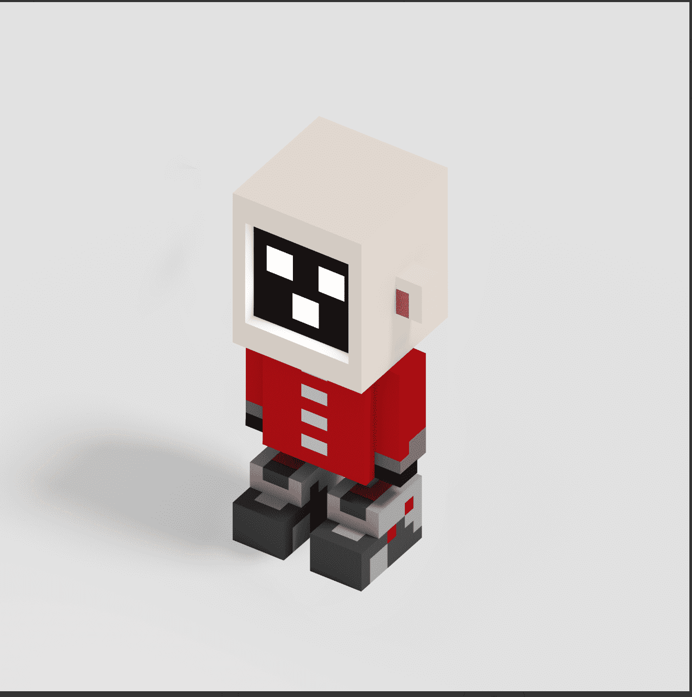

# Voxxt Primal

Primal Voxxt 是人类设计和计算机生成的 NFT 的集合，最大供应量为 5,000。它们是 Voxxt Verse 的基础，这是我们从艺术到生活、从游戏中赚取的游戏，玩家可以在虚拟世界中进行交易、战斗和赚取。Voxxt Primal NFT - 常见问题（FAQ）
▶ 什么是 Voxxt Primal？
Voxxt Primal 是一个 NFT（不可替代令牌）集合。存储在区块链上的数字收藏品集合。
▶ 有多少 Voxxt Primal 代币？
Voxt 有 2,498 个 Voxxt Prim NFT。 目前，52 个位置的原始中至少有一个 NT。
▶最近基本了多少？
过去 30 个 Voxxt 出 0 个 Primal NFT。

