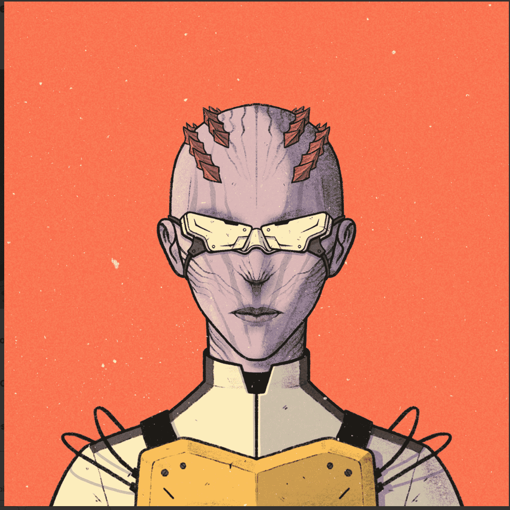

# VR Future Genesis

欢迎来到未来。许多长期想象的技术现在与我们同在——量子计算、微型、强大的电池、延长寿命的纳米技术，以及使我们能够殖民太阳系的航天工业——甚至更进一步。

但我们生活中最具变革性的事情是我们称之为 Gear 的强大的虚拟和增强现实技术。它看起来像一个面具，或者一副眼镜。当你足够大时，你会得到你的第一个个人装备——打开一个全新的宇宙。

使用 Gear，您可以在无限多的虚拟世界中工作、学习和娱乐，并在这个世界中探索丰富的附加意义。

Gear 技术的全称是 Assisted User Gear，或 AUG，使这成为可能。我们通过思想控制我们的装备。这需要数年时间来学习，但一旦我们掌握了我们的装备，我们就会变得比我们的祖先想象的更强大、更有创造力、更自我。您可以从大公司或附近的黑客那里获得 Gear，但无论您从哪里获得 Gear，Gear 已经改变了我们生活的方方面面。

想象一下控制一台巨大的机器，并带着一个愿望把它送到星星上。想象一下，你是一名观察身体最小细节的医生，或者是一名用你的思想作曲的音乐家。想象一下在木星表面行走，或与古希腊哲学家争论，或在只有你能看到的路径上穿越你的家乡。

我们与机器人（下载到类人身体中的人工智能）和外星人分享我们的旅程，他们邀请我们加入更广阔的星系，并帮助永远保存意识之光。

使用我们的 Gear，我们所做的不仅仅是学习、工作和娱乐。我们也打架。 Gear的力量释放了许多机会，但这也意味着有些人已经屈服于心灵病毒的疯狂。我们保持头脑和武器的锋利。

企业民兵、帮派、抵抗战士和邪教在我们的街道上作战，使用 Gear 为他们的盟友留下秘密信息，为他们的敌人留下陷阱。

