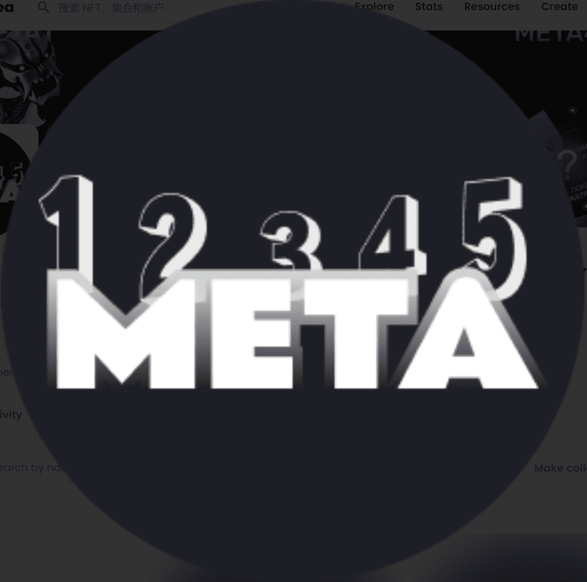

# VRMETA .

VRMETA 是一个以社区为重点的 NFT 集合，包含 9,9999 稀有 NFT。而 NFT 就是 140 种属性（如帽子、皮肤、皮肤等）的组合算法通过眼睛生成的！VRMETA 在以太坊（ ETH）区块链上推出，以可接受的价格提供一流的精品，同时广泛的路线。虚拟实境。NFT - 常见问题（FAQ）
▶ 什么是 VRMETA .?
虚拟实境。是NFT（替代代币）集合。存储在区块链上的数字收藏品不可收藏。
▶ 多少VRMETA。代币存在吗？
在有 100 个 VRMETA 。目前有 2 个 FT 有一个 VRMET。NTF 至少有他们的一个。
▶ 多少VRMETA。最近有卖吗？
有 0 个 VR 过去 30 个 MET 售出的 NFT。

