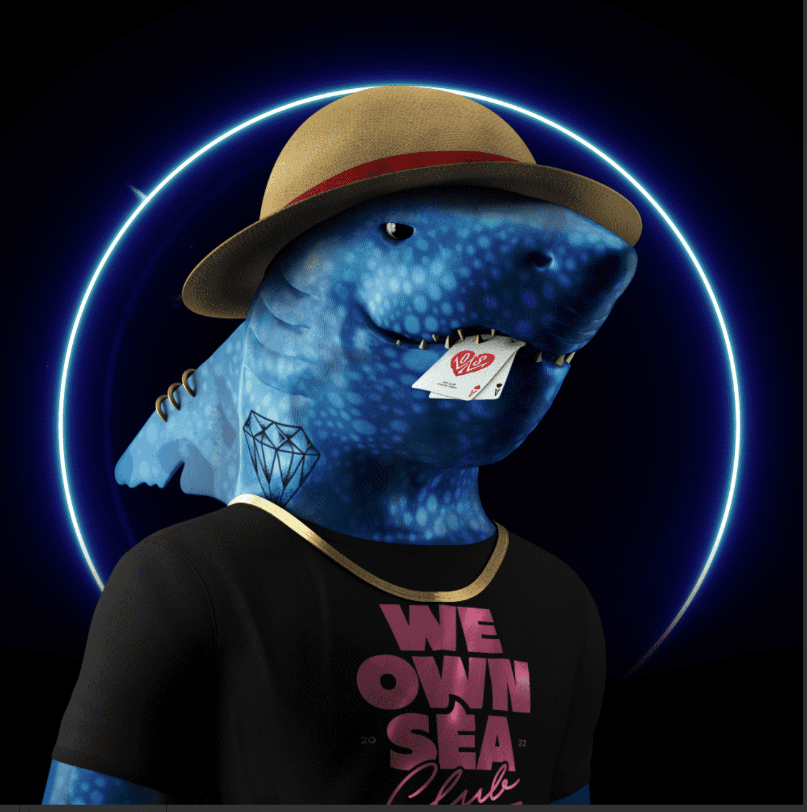

# W.O.S. Club Sharks

持有人和慈善机构的收藏！W.O.S. Club 是由 7,777 条鲨鱼组成的集合，由 195 种元素和纹理生成，灵感来自极客宇宙，具有未来感，而且总是别致而优雅。每个都有 5 到 12 个角色特征：背景、鲨鱼皮、鱼鳍配件、眼睛、牙齿、纹身、服装一、颈饰、服饰二、头饰、嘴饰。W.O.S. Club Sharks NFT - 常见问题（FAQ）
▶ 什么是 W.O.S.鲨鱼俱乐部？
W.O.S. Club Sharks 是一个 NFT（不可替代代币）集合。存储在区块链上的数字艺术品集合。
▶ 多少 W.O.S. Club Sharks 代币存在吗？
总共有 7,777 W.O.S. Club Sharks NFT。目前 303 位业主拥有至少一个 W.O.S. Club Sharks NTF 在他们的钱包里。
▶ 最昂贵的 W.O.S.鲨鱼俱乐部出售？
最昂贵的 W.O.S. Club Sharks NFT 出售的是 W.O.S.鲨鱼俱乐部#2158。它于 2022 年 6 月 22 日（2 个月前）以 16.5 美元的价格售出。
▶ 多少 W.O.S. Club Sharks 最近卖了？
有 3 个 W.O.S. Club Sharks NFT 在过去 30 天内售出。
▶ 什么是流行的 W.O.S.鲨鱼俱乐部的替代品？
许多拥有 W.O.S. 的用户Club Sharks NFT 还拥有 Ancient Dragons Gen1、Ghetto SharkHood、Snippets of prose 和 After-Death。

