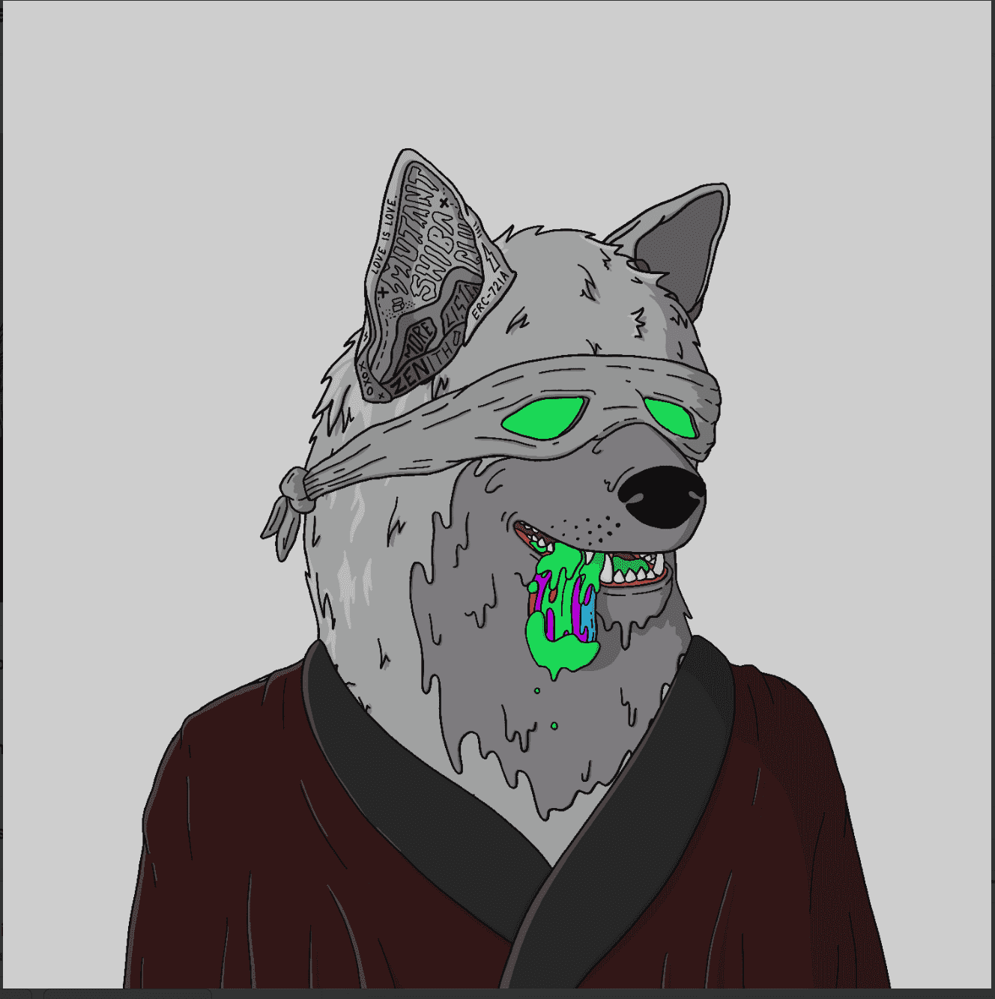

# Mutant Shiba Club

Mutant Shiba Club 是 10,000 个动画 NFT 的集合。每个 NFT 都是独一无二的，并且驻留在以太坊区块链上。您的 Mutant Shiba Club NFT 将成为您的俱乐部会员资格。变种人芝俱乐部| MSC NFT - 常见问题（FAQ）
▶ 什么是变种柴俱乐部 | MSC？
变种人芝俱乐部| MSC 是 NFT（NFT）收藏品存储在区块链上的一个数字收藏品。
▶ 多少芝俱乐部 | MSC代币存在吗？
有多少个俱乐部10,00个俱乐部| MSC NFT。目前4,659位车主至少拥有一个Mutant Shiba Club | MSC NTF 在他们的钱包里。
▶什么是最贵的变种人柴犬俱乐部 | MSC销售？
最贵的变种柴俱乐部|出售的 MSC NFT 是 Mutant Shiba。它于 2022 年 6 月 25 日（2 个月前）以 337 美元的价格售出。
▶ 多少芝俱乐部 | MSC最近卖了？
有894个变异柴犬俱乐部|过去 30 款售出的 MSC NFT。
▶ 一个变种人柴俱乐部| MSC费用？
近30天最便宜的变种柴俱乐部| MSC NFT 的平均费用为 54 美元，最多超过 27 美元。Mut Shiba Club 的中位价 | MSC NFT 在过去的 30 美元为 87 美元。
▶ 什么是流行的Mutant Shiba Club | MSC 替代方案？
拥有Mutant Shiba Club的众多用户| MSC NFT 还拥有 HAKI NFT、Shinsekaicorp、Shinsekai Portal 和 Los Muertos World。
变种人芝俱乐部| MSC 社区统计

