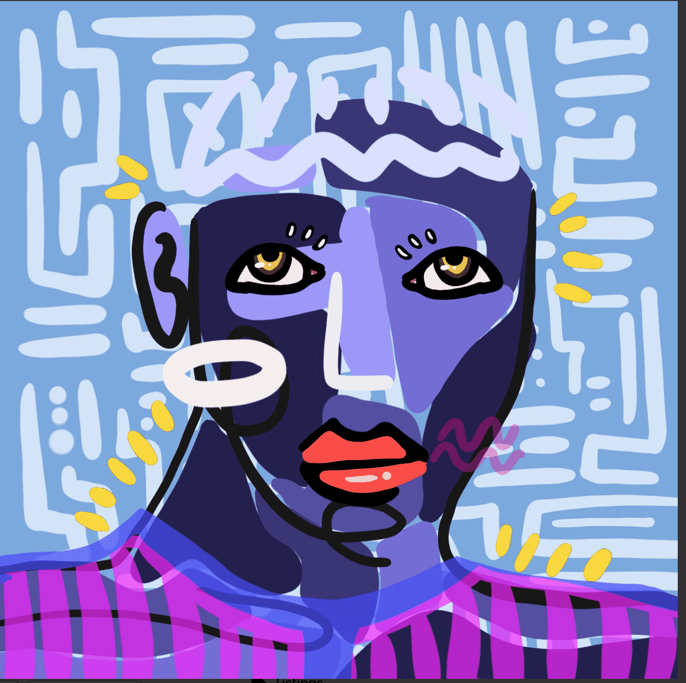

# wackies

Wackies 是 Camille Chiang 肖像艺术的动画生成版本，提供 1,000 幅独特的作品。每个 ERC721 代币都存在于古怪智能合约下的区块链上。每个 NFT 以 0.08 以太坊的起始价格购买，然后可以在二级市场上出售。

Camille Chiang 是一位在香港出生和长大的当代艺术家，现居住在旧金山。她专注于通过一系列引人注目的混合媒体肖像来捕捉人类行为的详细情感。

“作为一名艺术家，我的目标是捕捉我们内心深处不为人知的小故事。我想唤起我们经常忽视或掩埋的感受和情感。使用混合媒体，我从混乱到精确线性工作，加入抽象和超现实主义艺术世界来表达脆弱和身份。”

