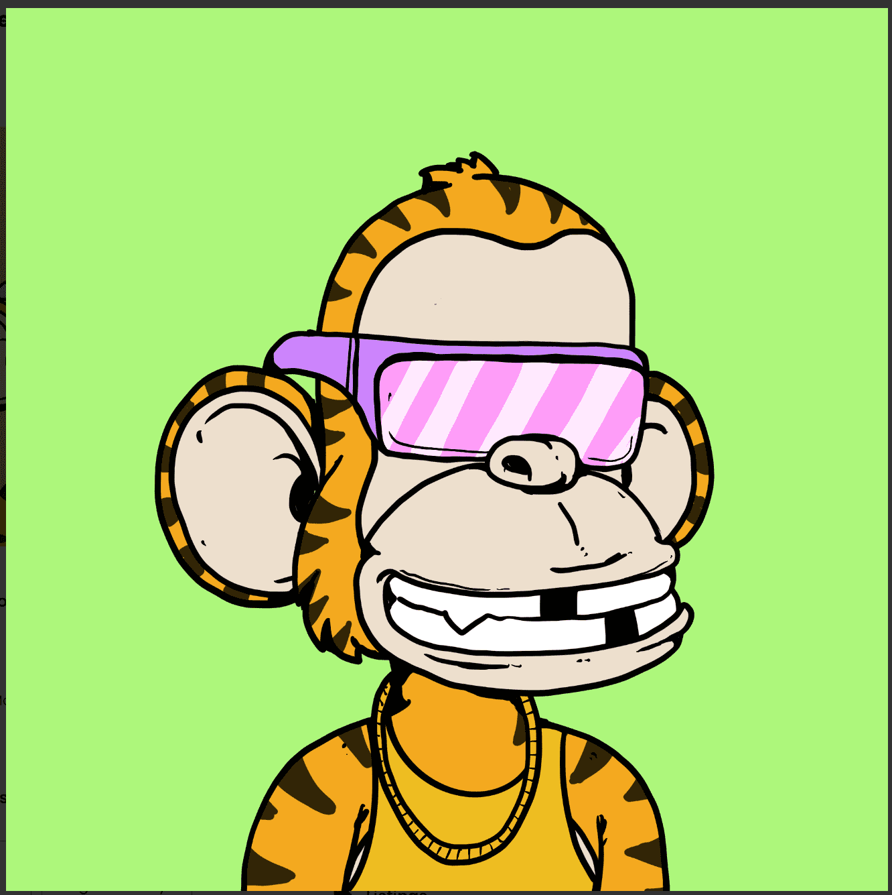

# Wacky Monkeys Collection

ERC-721A NFT 标准

我们所有的 NFT 都是 ERC-721A。很酷的是你为每笔交易支付汽油费，而不是每铸造一个代币。你铸造一个代币 - 支付特定费用，你铸造 6 个 - 你支付相同的费用。简单的！

古怪的猴子
是以太坊岛上令人毛骨悚然的 6000 个 NFT 的集合。
薄荷只需 0.001 eth - 比一根香蕉便宜 🍌
07.07.2022路线图
第一阶段....想法

- 嘿猴子！在我们的岛上似乎有点无聊。以免打电话给 6000 位朋友，举办一场盛大的派对……
- 之后？
- 我们会冷静下来之后。
-是的！！！

第二阶段....聚会时间

——这一天来了！我们的朋友今天到了....
- 岛上的入场费是多少？
- 不要担心最后 0.001 eth，我们必须购买啤酒、鸡尾酒、小吃和许多好吃的东西。

第三阶段....社区时间

- 嘿猴子，我们在这里放松和玩得开心，让我们想想接下来要做什么！
- 是的，让我们开始吧！！！
- 
