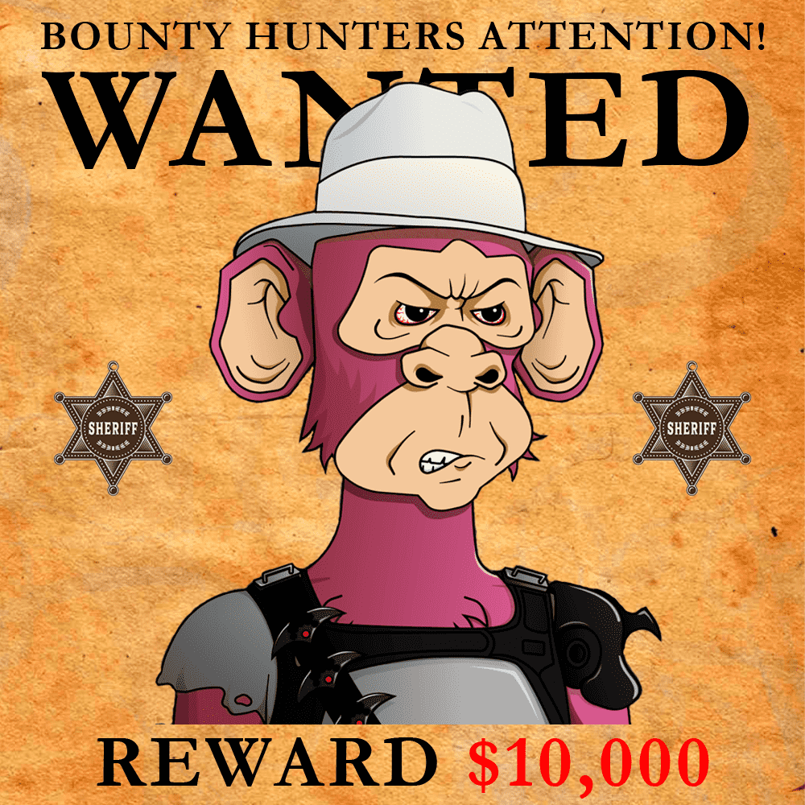

# Wanted Apes Club

缉猿俱乐部统计
创建于 7 个月前
1,111 代币供应
9.25% 费用
过去 7 天没有出售通缉猩猩俱乐部。

很久以前，狂野西部有一群通缉猩猩。通缉的猿类生活在不同的州。该俱乐部由 1111 名独特的土匪组成，他们为此提供了不同的奖励。想要你的猿！
Wanted Apes Club NFT - 常见问题 (FAQ)
▶ 什么是通缉猿俱乐部？
Wanted Apes Club 是一个 NFT（非同质代币）集合。存储在区块链上的数字艺术品集合。
▶ 通缉猿俱乐部代币有多少？
总共有 1,111 个 Wanted Apes Club NFT。目前，55 位车主的钱包中至少有一个 Wanted Apes Club NTF。
▶ 通缉猿俱乐部最近卖出了多少？
过去 30 天内共售出 0 个 Wanted Apes Club NFT。

