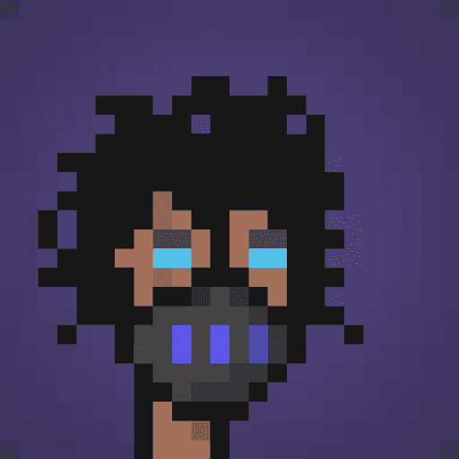

# WANTED PUNKS OFFICIAL

Wanted Punks 是在以太坊区块链上创建的仅 1000 个 NFT 的独家收藏。每个朋克都配备了自己独特的伪装，这些伪装由一组经过算法应用的手工制作的特征和配饰组成。

准备好揭开头号通缉犯的秘密身份。

初始铸币的 15%将直接捐给由 discord 投票选出的慈善机构！

在 3 天内，观看您的朋克在每小时更新的排行榜上与其他参与者正面交锋，以完成列出的目标。第一个允许成功的朋克将在奖池中获得一席之地。成功/失败率是通过算法计算的 - 由朋克稀有度决定（朋克越稀有，成功的机会就越高）。您将能够通过下面的门户计算您的概率。

为极其罕见的外星人、僵尸或突变朋克试试运气

通过基于百分比稀有度的代码应用每组独特的特征和配件。这赋予了一些朋克比其他朋克更稀有的属性。在铸币日，每个人都有能力以相同的价格购买随机的朋克。

