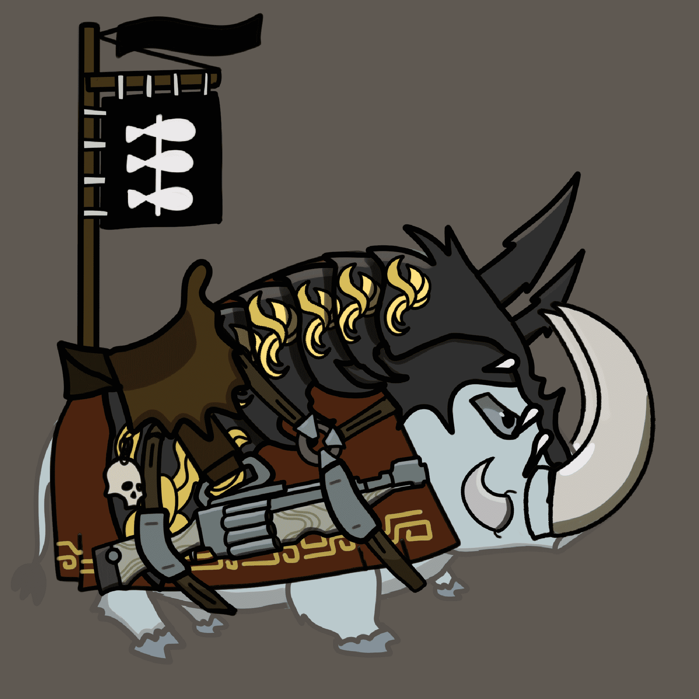

# Warhogs

Warhogs NFT - 常见问题（FAQ）
▶ 什么是战猪？
Warhogs 是一个 NFT（非同质代币）集合。存储在区块链上的数字艺术品集合。
▶ 有多少 Warhogs 代币？
总共有 5,555 个 Warhogs NFT。目前，1,202 位车主的钱包中至少有一个 Warhogs NTF。
▶ Warhogs 最昂贵的销售是什么？
售出的最昂贵的 Warhogs NFT 是 Warhogs #5033。它于 2022 年 6 月 12 日（3 个月前）以 66.1 美元的价格售出。
▶ 最近卖出了多少战猪？
过去 30 天内售出了 273 个 Warhogs NFT。
▶ Warhogs 的价格是多少？
在过去 30 天里，Warhogs NFT 最便宜的销售额低于 1 美元，最高销售额超过 18 美元。Warhogs NFT 在过去 30 天内的中位价格为 7 美元。
▶ 什么是流行的 Warhogs 替代品？
许多拥有 Warhogs NFT 的用户还拥有 We Are All Going to Leave、 PAPC-Punk Ape Pixel Club、 OmniTrolls (eth)和 SKREAMAZ。

