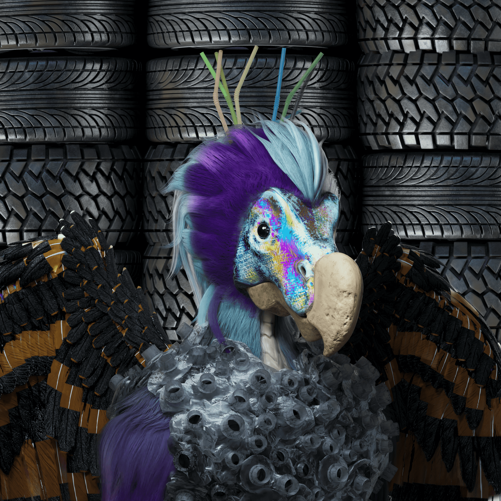

# Wasted Wild by Capsule Vault

Capsule Vault 浪费了 Wild NFT
铸造一个废弃的野生 NFT 并在物理世界中种植一棵树。通过保护濒临灭绝的物种和栖息地来恢复野外。到目前为止，我们已经在 Capsule Vault 社区种植了 17000 棵树。Capsule Vault 团队自豪地展示了 Wasted Wild，这是 2000 个虚构生物的集合。虽然每一个 Wildling 都是独一无二且精心设计的 NFT；你，野外的先驱者，不仅将拥有这些资产的高度精细的艺术品和完全的商业权利，而且将来还可以与你的 Wildings 一起进入 Capsule Vault Metaverse！

