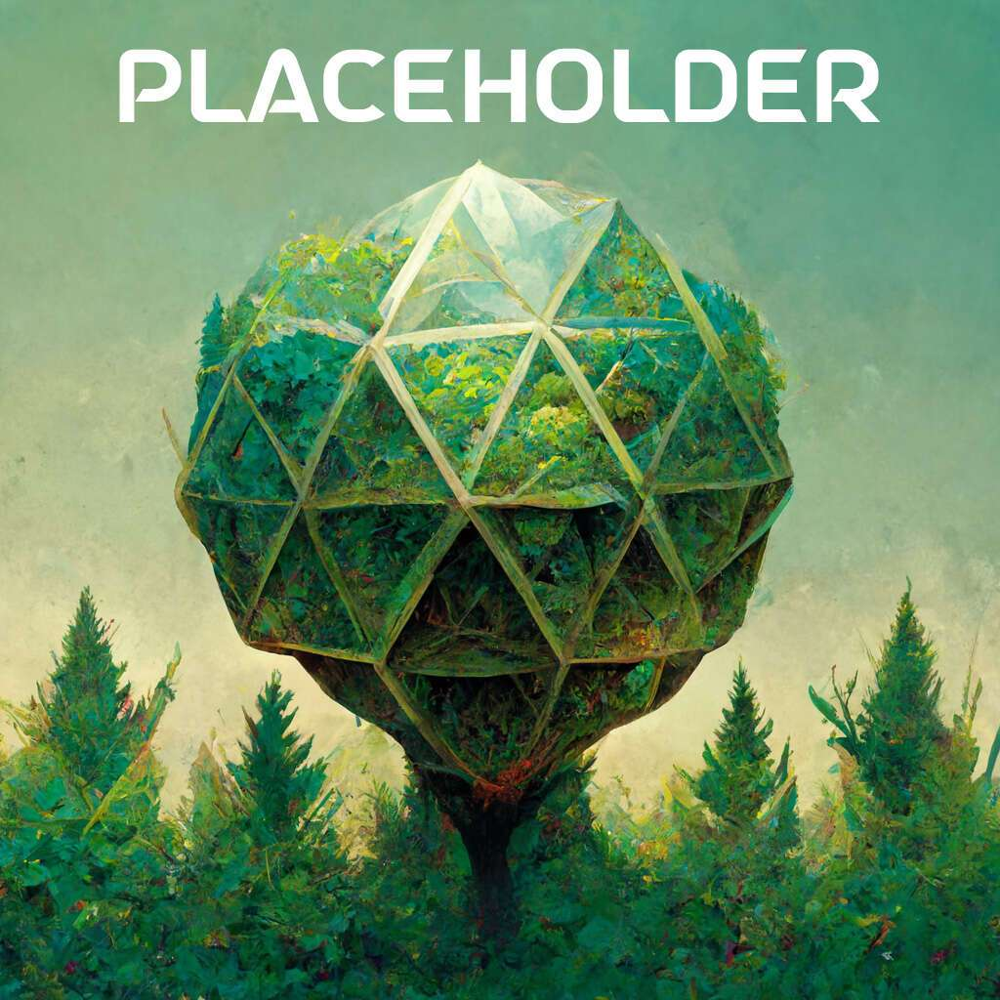

# We Are All the SA

欢迎来到ICOSA
Icosa (ICSA) 是一种基于 Hedron 协议的协议，用于添加 HDRN 质押和额外激励以质押 HEX 以及启动 Hedron 借贷系统。Icosa 由 Hedron 协议背后的同一团队构建，确保无缝集成。
将 HSI HEX 股份出售给 Icosa 合约，在 ICSA 中获得报酬。恒指将按合约借入并送去拍卖。是的，这意味着您可以选择在上述拍卖中重新购买您的股份。
为 ICSA 质押 HDRN，每日收益由 Hedron 合约内每日销毁的 HDRN 数量决定。有与赌注大小相关的最小赌注长度和奖金。

重点是什么？
HDRN 和 HEX 持有人的激励措施
Icosa 的存在既允许 HDRN 持有者产生收益，又以 HSI HEX 股份的形式吸收自由市场 HEX，并以 HDRN 和 HEX 同等受益的方式将这些股份分配给社区。HDRN 质押者可以享受 ICSA 形式的收益以及恒指回购机制的燃烧效应。HEX 质押者可以享受减少的抛售压力，并能够通过自由铸造的 HDRN 竞标这些 HSI HEX 股份。

