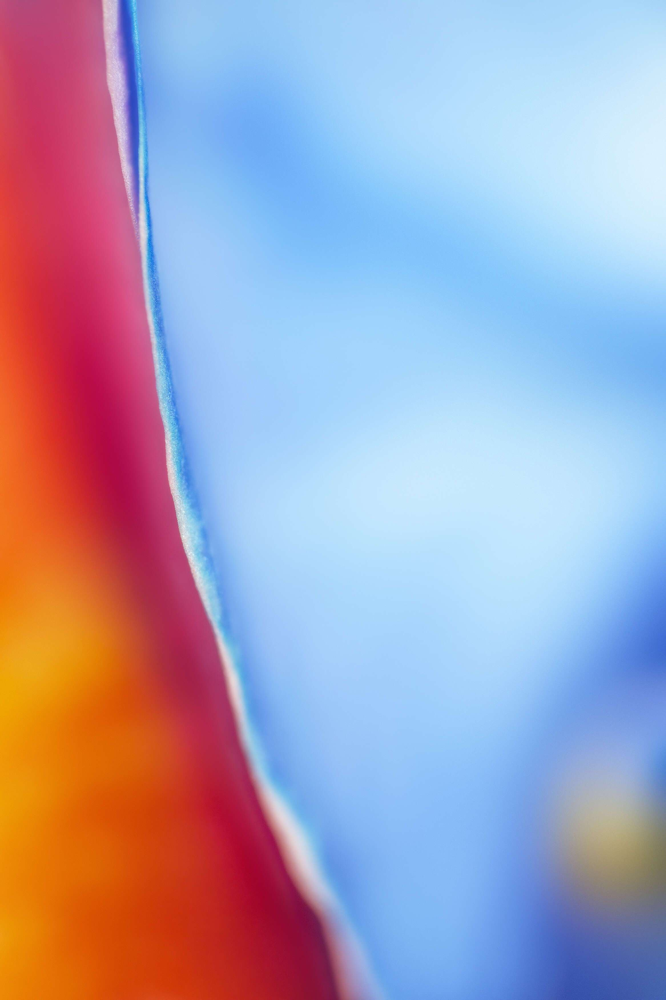

# We Are Rainbows

-我们是从风暴中诞生的。我们闪耀，因为我们是彩虹——

该系列是对蝴蝶兰的研究。它诞生于拍摄蓝色和紫色的需要，但兰花有多种颜色，很快就变成了彩虹。一切的发生都是有原因的，而这个系列的形成是因为我有话要说。我是一个慢性偏头痛患者。我每天都生活在痛苦和疲劳中。我很少离开家，经常躺在床上康复，但这并不能阻止我梦想着一个更光明的未来，并尽可能地振作起来。我们都有挣扎，但重要的是我们如何应对它们。最大的风暴会产生最美丽的彩虹。我们都是彩虹，我们闪耀着所有的颜色。

该系列是根据 Manifold (ERC-721) 合同铸造的。铸造的拼贴画将赠送给一个持有人，在购买每件作品后随机选择。

