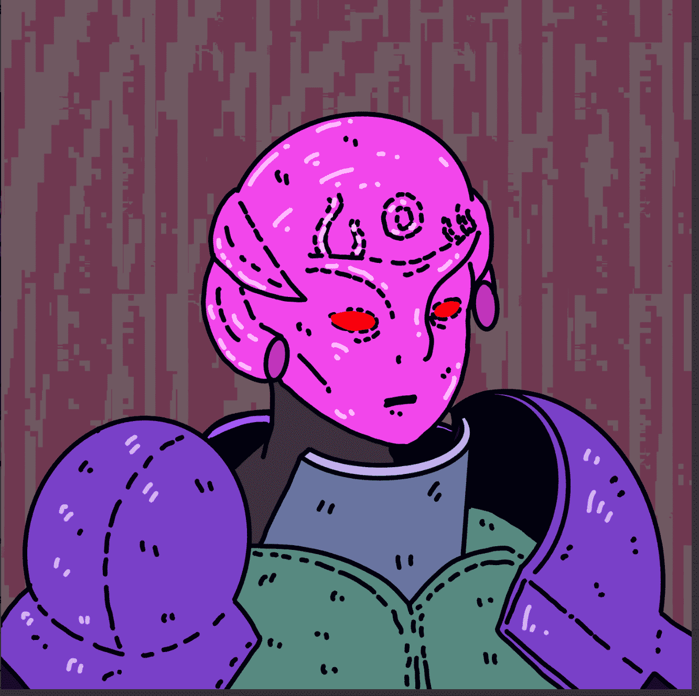

# We Are All Going To

由道尔顿曼纳鲁德带给您我们都去 NFT - 常见问题（FAQ）
▶ 什么是我们都做的？
We Are All Going To 是一个 NFT（不可替代代币）集合。存储在区块链上的数字收藏品集合。
▶ 存在多少个We Are All Going To 代币？
有，10个我们都将使用NFT目前36位我们都将有一个NT。
▶ We Are All Go to Sale 最贵的是什么？
最贵的 We Are All Going To NFT 是 We Are All Going To #004。它于 2022 年 6 月 13 日（3 个月前）以 456.9 美元的价格售出。
▶最近的目标是什么？
过去使用 30 个我们都将提供 55 个 NFT。
▶ 我们会付出多少？
在过去的 0 天里，我们都将使用 NFT 的价格为 18 美元，最多 1 美元 126 美元，在过去的 0 美元中，我们都将使用 NFT 的价格为 120 美元。
▶ 什么是流行的我们都在寻找替代品？
拥有 We Are All Going To NFT 的用户还拥有 STUFF FOR MY PEOPLE、GLITCHSAFARI、Shards of Magnus Editions 和 Dalton Mannerud。

