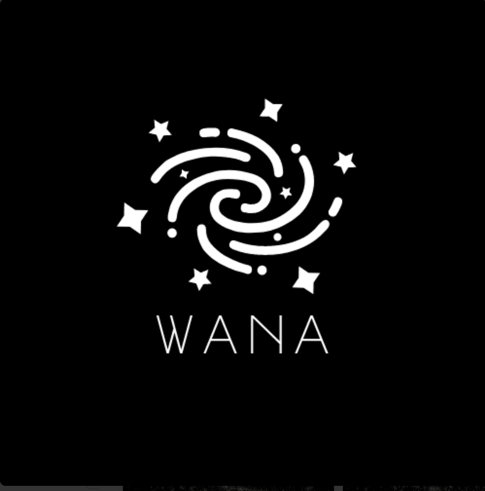

# WeAreNotAlone

WeAreNotAlone NFT - 常见问题（FAQ）
▶ 什么是 WeAreNotAlone？
WeAreNotAlone 是一个 NFT（Non-fungible token）集合。存储在区块链上的数字艺术品集合。
▶ 存在多少 WeAreNotAlone 代币？
总共有 357 个 WeAreNotAlone NFT。目前，339 位所有者的钱包中至少有一个 WeAreNotAlone NTF。
▶ 最近卖出了多少 WeAreNotAlone？
过去 30 天内售出 0 个 WeAreNotAlone NFT。过去 7 天内没有出售 WeAreNotAlone。

谁在那里？...你能听到我的声音吗？ ...

我一个人吗？宇宙无边无际，我怎么会孤单……

......

เ'๓ ђєгє。 ฬเՇђץ๏ย。

ฬє คгє ภ๏Շ คɭ๏ภє。

ฬคภՇ Շ๏ รєคгςђ ฬเՇђ ๓є Շђє ђเ๔๔єภ รєςгєՇ เภ Շђє รՇคгร?

