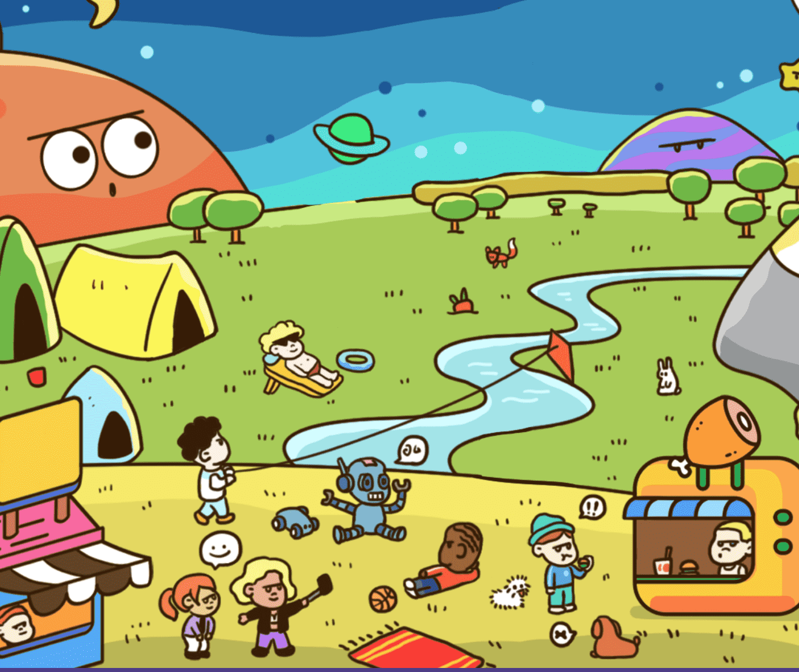

# WeArePiplWorld Land

介绍
Pipl（发音为“people”）是一个基于新一代互联网 WEB3 的慈善社区，在以太坊区块链上创建多个收藏品作为独特的、不可替代的代币（NFT）。我们将继续与不同的艺术家和各种慈善组织合作，发布以我们的愿景为重点的系列，以有趣和创造性的方式促进社会、人道主义和环境慈善事业。PIPL的愿景
Pipl 的愿景是为新一代创造另类慈善事业。通过创建我们的 NFT，我们旨在支持和促进地球及其人民的福祉，尤其是那些有需要的人。对于每一次 NFT，我们都会向来自世界各地的精选和有信誉的慈善组织捐款，并建立一个基金来支持各个项目。我们还将与这些组织赞助和共同举办活动，我们都可以参与其中。我们相信，通过将新技术和 Web3 一代与慈善事业相结合，我们 Pipl，包括我们的 NFT 持有者，可以创造一个世界没有饥饿，没有歧视，没有性别偏见，没有暴力，没有枪支，当然，没有战争！一个人人平等、我们和平相处的世界。爱与和平是我们的核心。我们是Pipl！

