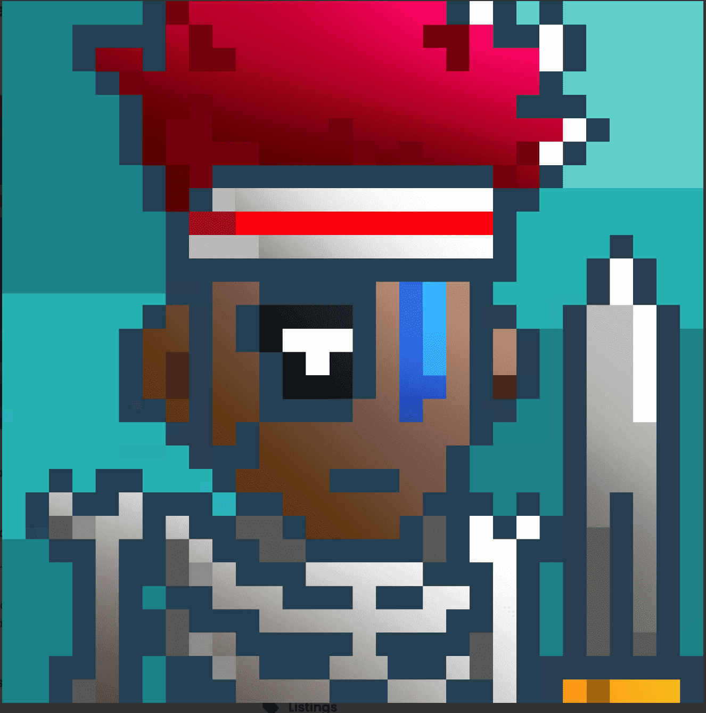

# Web3Warriors

Web3 Warriors 由 Odyssey Labs 创建并作为免费铸币提供，旨在成为 NFT 新手的接触点，提供高质量的艺术品和流畅的铸币体验。Web3 Warriors 的收藏不断扩大，也可作为入职、教育的保护伞和 web3 空间中的网络——包括但不限于 NFT、metaverse、DeFi 和区块链技术的其他用例。Mint a Web3 Warrior：s.art/ 了解有关 Odyssey Labs 的更多信息▶ 什么是小勇士？
Wee Warriors 是一个 NFT（不可替代令牌）集合。存储在区块链上的数字艺术品集合。
▶ 有多少个 Wee Warriors 代币？
总共有 10,008 个 Wee Warriors NFT。目前，115 位车主的钱包中至少有一个 Wee Warriors NTF。

