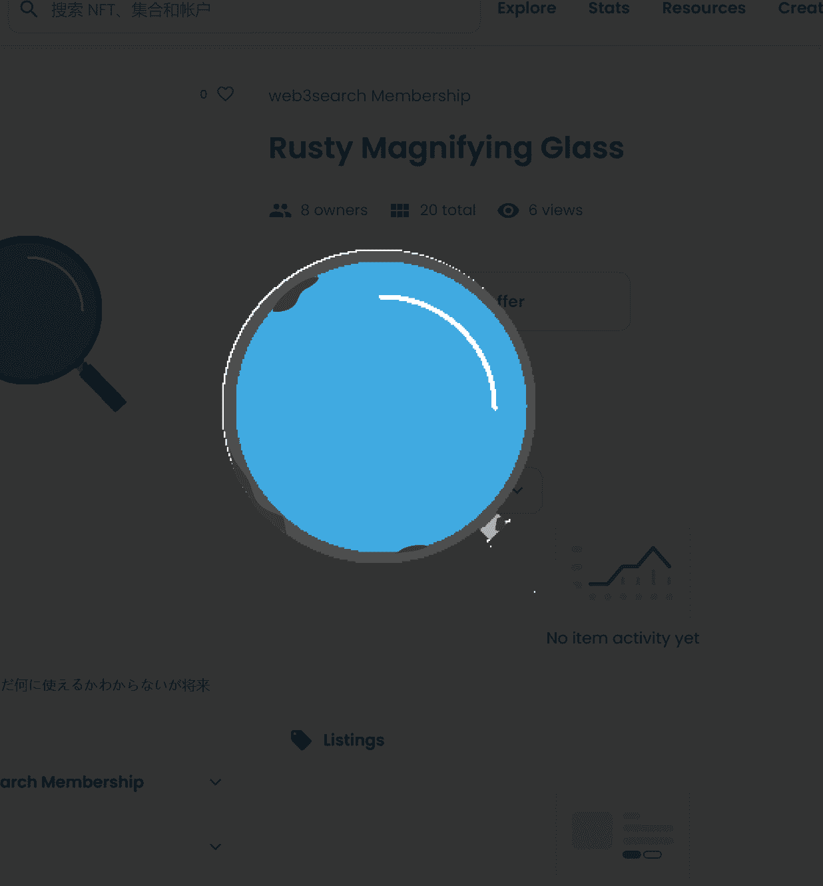

# web3search Membership

web3search 会员卡。持有者可以获得服务价格折扣，并在支持者页面上列出。 MVP 是 com，但 beta 产品正在开发中，很快就会在测试网上部署。服务概念和细节在这里web3search Membership NFT - 常见问题（FAQ）
▶ 什么是 web3search 会员资格？
web3search Membership 是一个 NFT（不可替代令牌）集合。存储在区块链上的数字艺术品集合。
▶ 存在多少个 web3search 会员代币？
总共有 64 个 web3search Membership NFT。目前 46 位所有者的钱包中至少有一个 web3search Membership NTF。
▶ 最近卖出了多少 web3search 会员资格？
过去 30 天内售出了 1 个 web3search Membership NFT。
▶ 什么是流行的 web3search 会员替代方案？
许多拥有 web3search Membership NFT 的用户还拥有verylong“kimokawa”animals、Voxel Street、VeryLongRoboticsAnimals 和 VeryTokyoAnimals。

