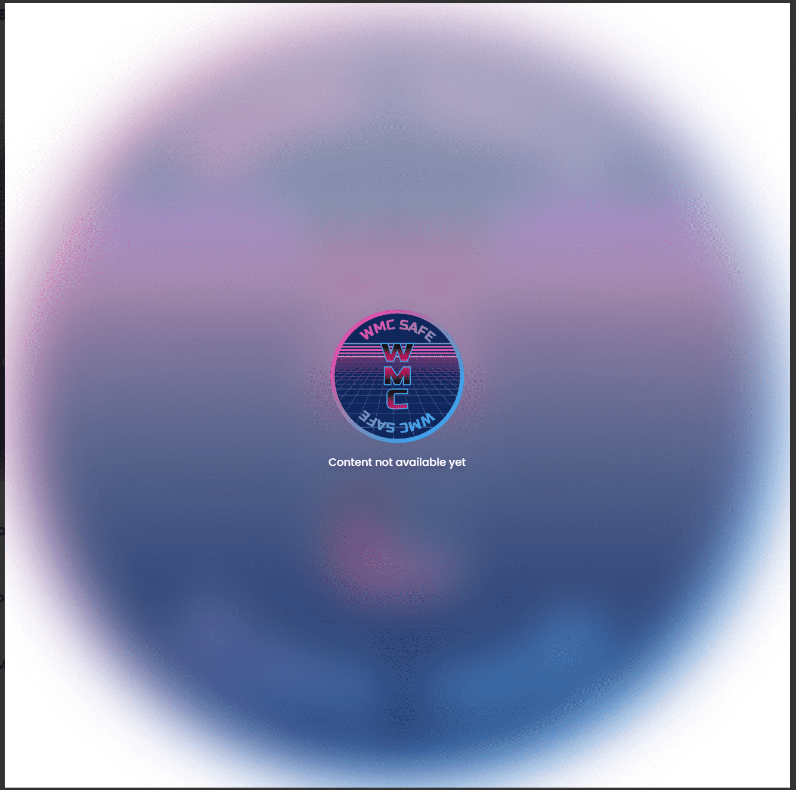

# WMC SAFE

WebMasonCoin Safe - 它是 WMC 代币的加密保险箱。
该系列有 20 亿个 WMC（占总供应量的 20%）。
10000个保险箱，每个保险箱200000个WMC，锁5年。您可以烧掉保险箱并将 WMC 代币发送到您的地址。WMC SAFE NFT - 常见问题（FAQ）
▶ 什么是 WMC SAFE？
WMC SAFE 是一个 NFT（不可替代令牌）集合。存储在区块链上的数字艺术品集合。
▶ 有多少个 WMC SAFE 代币？
总共有 1 个 WMC SAFE NFT。目前 1 位所有者的钱包中至少有一个 WMC SAFE NTF。
▶ 最昂贵的 WMC SAFE 销售是什么？
售出的最昂贵的 WMC SAFE NFT 是 .它于 2022-06-13（3 个月前）以 298.3 美元的价格售出。
▶ 最近卖出了多少个 WMC SAFE？
过去 30 天内售出了 1 个 WMC SAFE NFT。

