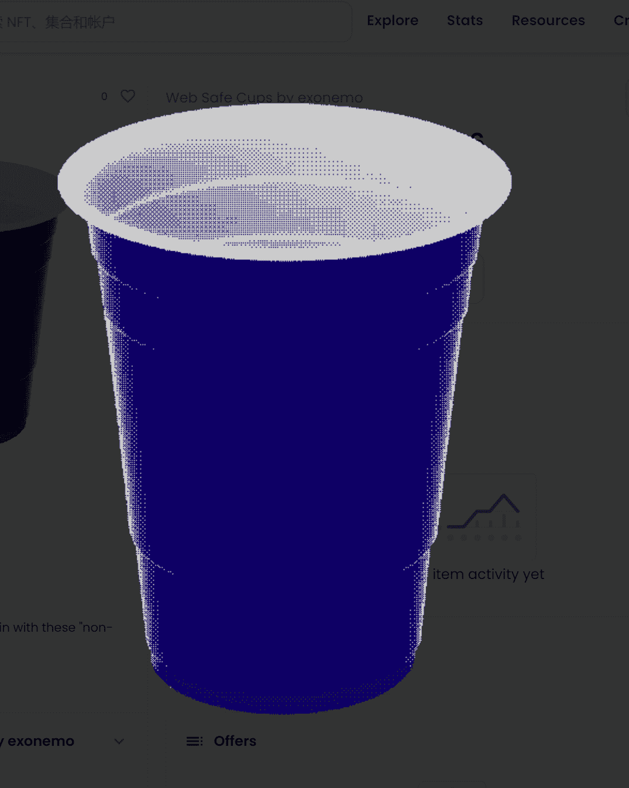

# Web Safe Cups by exonemo

“Web Safe Cups”是 exonemo 的 216 个限量版 NFT。它采用在美国常用的一次性塑料杯，用 216 种网络安全颜色着色，这些颜色在互联网早期被认为在不同平台上高度兼容。买1送216
购买一张 NFT 并获得 216 张带有网络安全彩色背景的 PNG 图像！！
倒任何你喜欢的东西
任何人都可以将多达 216 字节的数据倒入您的杯子中！！
永远保持
在你的杯子上写下你的名字，为一个永无止境的派对定制合同！！
环保杯
在基于 PoS 的 Polygon 区块链上为可持续的欢呼！

*作为杯子的拥有者，购买NFT后，您可以通过此页面的[交互]按钮获取PNG图像，在杯子上写下您的名字，并清空杯子中的内容。

