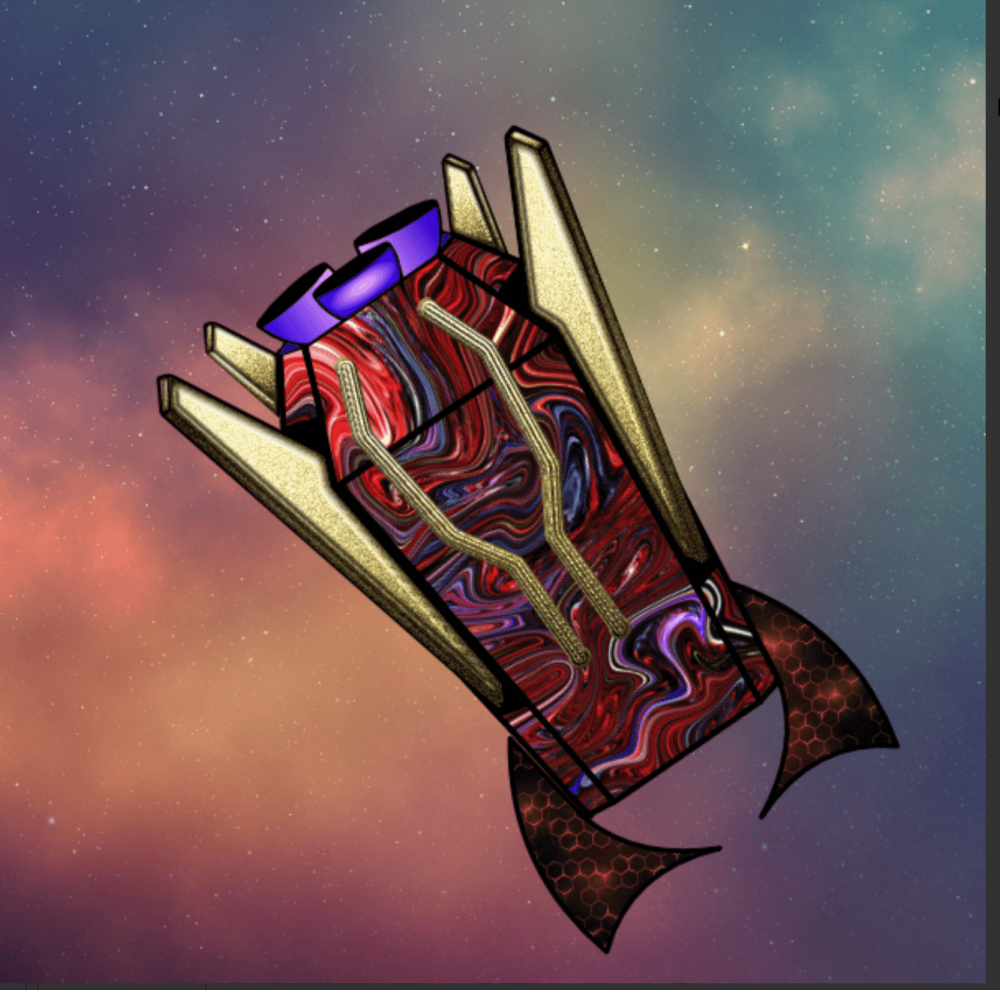

# WeGoBattle.com Pods

1000 个 WeGo 战斗吊舱系列！每个人都携带独特的突变基因填充 NFT，在进入 WeGo Battleverse 时揭示他们的物种。WeGoBattle.com Pods NFT - 常见问题（FAQ）
▶ 什么是 WeGoBattle.com Pod？
WeGoBattle.com Pods 是一个 NFT（不可替代令牌）集合。存储在区块链上的数字艺术品集合。
▶ 存在多少 WeGoBattle.com Pods 代币？
总共有 1,001 个 WeGoBattle.com Pods NFT。目前，170 位所有者的钱包中至少有一个 WeGoBattle.com Pods NTF。
▶ 最昂贵的 WeGoBattle.com Pod 销售是什么？
出售的最昂贵的 WeGoBattle.com Pods NFT 是 Go Pod #175。它于 2022-08-19（14 天前）以 605 美元的价格售出。
▶ 最近售出了多少 WeGoBattle.com Pod？
过去 30 天内售出了 2 个 WeGoBattle.com Pods NFT。
▶ 有哪些流行的 WeGoBattle.com Pod 替代品？
许多拥有 WeGoBattle.com Pods NFT 的用户还拥有 Retro Pandas、Social BEES University、Space Riders: OG Pass 和 Back To Work。

