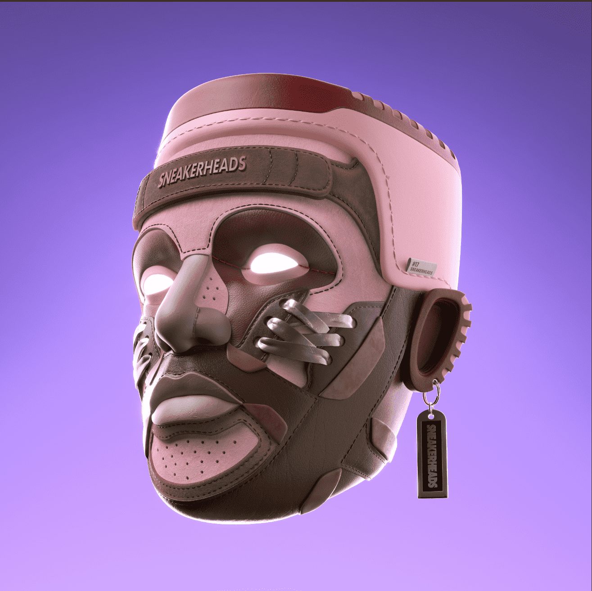

# Sneaker Heads

Sneakerheads 是由传奇艺术家和创始人 Ali Dawood 设计的 5000 个独特 NFT 的集合。超过 40 种精心设计的 3D 手绘基础模型具有无与伦比的细节水平 - 以前所未有的方式捕捉运动鞋的外观、感觉和风格。

这是一个基于社区和协作的基础设施的启动板，它将重新定义 Web3 中的街头文化世界。

访问我们的官方网站：sneakerheads.xyzSNEAKER HEADS 官方 NFT - 常见问题（FAQ）
▶ 什么是 SNEAKER HEADS 官方？
SNEAKER HEADS Official 是一个 NFT（Non-fungible token）集合。存储在区块链上的数字艺术品集合。
▶ SNEAKER HEADS 官方代币有多少？
总共有 5,000 个 SNEAKER HEADS 官方 NFT。目前，2,740 位车主的钱包中至少有一个 SNEAKER HEADS Official NTF。
▶ 最贵的 SNEAKER HEADS 官方促销是什么？
最昂贵的 SNEAKER HEADS Official NFT 是 SNEAKERHEADS #3489。它于 2022 年 6 月 24 日（2 个月前）以 1.65 万美元的价格售出。

