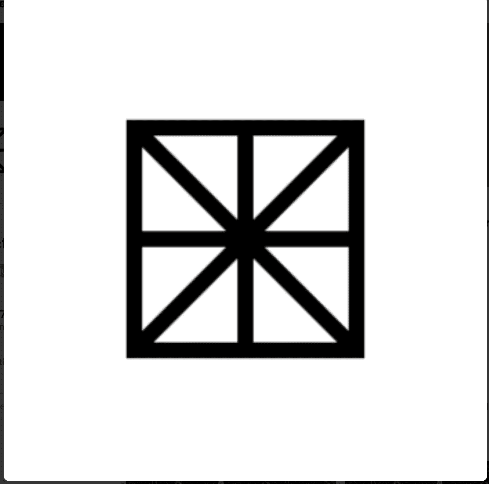

# WENEW presents Andy Murray's Wimbledon 2013 Victory

WENEW 的首个系列记录了这位网球传奇人物在 2013 年温布尔登网球公开赛上的胜利，这不仅结束了英国 77 年对本土绅士单打冠军的等待，而且也将他变成了民族英雄。由温布尔登和穆雷本人认证。WENEW 呈现 Andy Murray 的 2013 年温网胜利 NFT - 常见问题 (FAQ)
▶ 什么是 WENEW 呈现安迪·穆雷的 2013 年温布尔登胜利？
WENEW 展示了 Andy Murray 的 2013 年温布尔登胜利是一个 NFT（非同质代币）系列。存储在区块链上的数字艺术品集合。
▶ WENEW 礼物安迪·穆雷的 2013 年温布尔登胜利代币有多少？
总共有 671 份 WENEW 呈现了 Andy Murray 的 2013 年温布尔登胜利 NFT。目前，267 位车主的钱包中至少有一份 WENEW 礼物 Andy Murray 的温布尔登 2013 胜利 NTF。
▶ WENEW 礼物安迪·穆雷的 2013 年温网胜利最近卖出了多少？
在过去 30 天内售出 0 件 WENEW 礼物 Andy Murray 的温布尔登 2013 Victory NFT。
▶ WENEW 有哪些热门的安迪穆雷 2013 年温布尔登胜利替代品？
许多拥有 WENEW 的用户展示了 Andy Murray 的 2013 年温布尔登胜利 NFT，还拥有 EL NUMEROS、DegenOkayBears、WaterBe4nZukis 和 Old Legacy。

