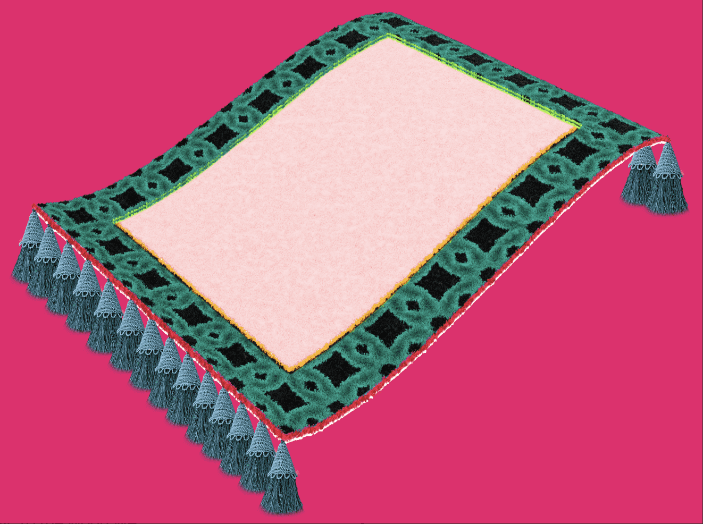

# Wen Rug Pull

专为您打造的地毯 Rug Pull 团队在创建了 6969 块在以太坊区块链上铸造的手绘地毯供您添加到您的收藏后，对该项目寄予厚望。

Rug Pull 团队在一段充满激情的旅程中找到了彼此，因为每个团队成员都被 NFT 行业和社区中的人们所震惊。现在轮到我们提供您永远不会忘记的体验了。

为了创造这种体验，地毯充满了实用性。这款地毯是您想要保留在收藏中的一件物品。自从那些漂亮的旋转鸡蛋以来，还没有一个 NFT 具有如此强烈的排他性。您是否会成为众多回首往事并后悔没有得到地毯的人之一？

总共将铸造 6969 个（好！）地毯，每个 0.02 ETH。所有铸造的地毯都被卷起并隐藏起来，直到所有地毯售罄后 5 天。没有结合曲线...因为那将是一个骗局。

