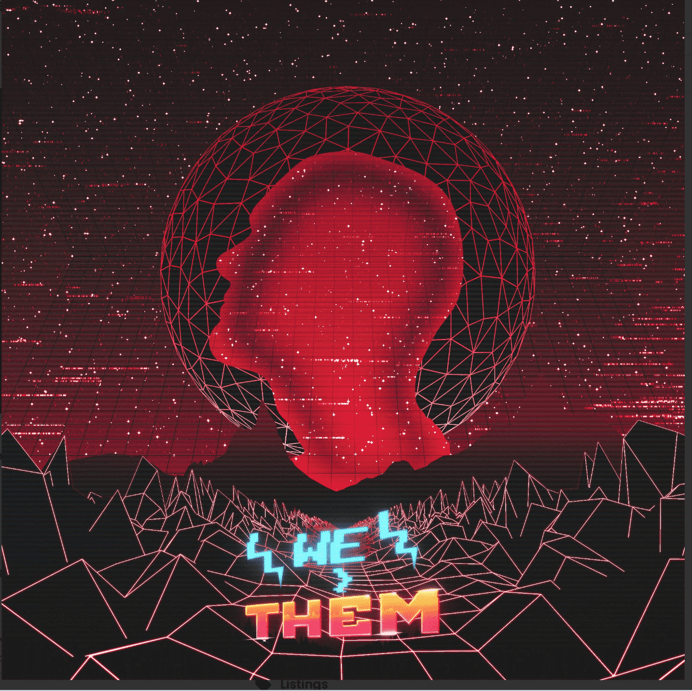

# We>Them: Sacred Society

欢迎来到 OG We>Them Rebels 的神圣协会我们>他们：神圣社会 NFT - 常见问题（FAQ）
▶ 什么是我们>他们：神圣社会？
We>Them: Sacred Society 是一个 NFT（非同质代币）集合。存储在区块链上的数字艺术品集合。
▶ 有多少 We>Them: Sacred Society 代币存在？
总共有 370 个 We>Them：Sacred Society NFT。目前，347 位所有者的钱包中至少有一个 We>Them: Sacred Society NTF。
▶ 最昂贵的 We>Them：Sacred Society 特卖是什么？
最昂贵的 We>Them: Sacred Society NFT 出售的是 Sacred Rebel #45。它于 2022 年 6 月 26 日（2 个月前）以 196.5 美元的价格售出。
▶ We>Them: Sacred Society 最近卖了多少？
过去 30 天内售出了 7 个 We>Them: Sacred Society NFT。
▶ 什么是流行的 We>Them：Sacred Society 替代品？
许多拥有 We>Them: Sacred Society NFT 的用户还拥有 We>Them: Society of Rebels、EL NUMEROS、DegenOkayBears 和 WaterBe4nZuki。

