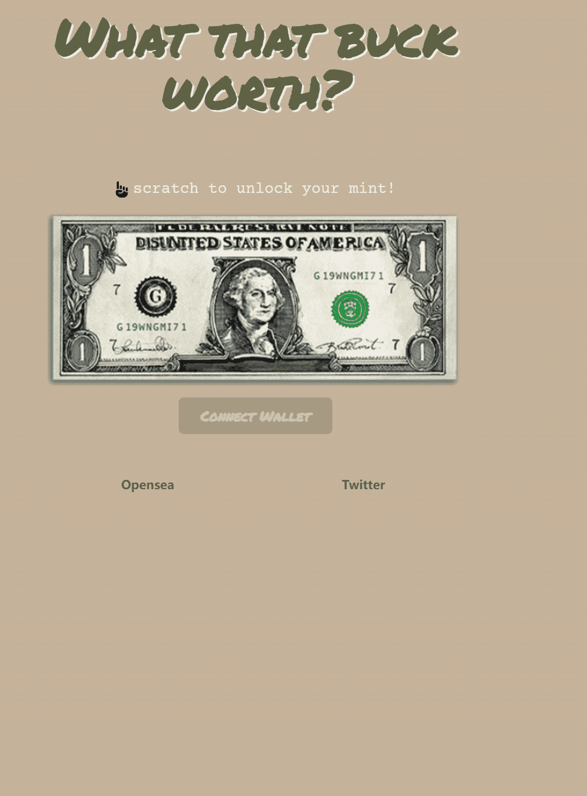

# What That Buck Worth

通过艺术，我们质疑自己，并邀请每个人思考正在发生的事情。我们的作品是使用生成算法以及纸和笔创作的。我们用我们的手和我们的电脑什么是巴克沃思？
@wutdatbuckworf
·
8月3日
关于收藏：

1. 1971 件。
2.即时揭示。
3. CC0。
4. 我们只为团队索赔 7 件。
5. Max Mint：每笔 1 个。
6. 1970 年代首创的免费薄荷糖。
7. 最后一件#1971，售价1971 ETH。认真的人。如果我写一篇关于收藏的文章，解释动机、艺术风格、参考资料等。

