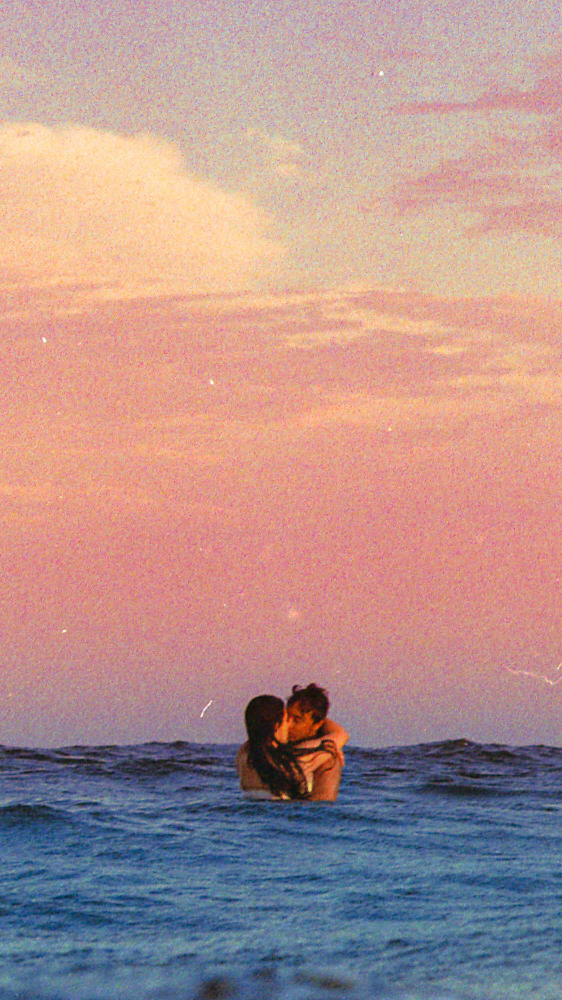

# When Two Stars Collide

从为什么创作到如何创作，《当两颗星相撞》对我来说是一部如此重要的作品，有很多原因。这张照片的灵感来自爱，用爱创作，旨在表达恋爱的感觉。当我构想这张照片时，我没有计划拍摄。我会告诉自己，“时机成熟时会发生的”。一天在海滩上，我走近了一对看起来非常相爱的夫妇。他们同意拍摄，我们就下水了。我让他们亲吻，在那一刻，我的整个视野都栩栩如生。我脑海中不断看到的照片终于锁定在我的 Portra 800 卷上，我只需要冲洗它。2021年上映后，触动了很多人，感觉是我作为摄影师最大的成就。当我把这件作品变成1/1时，有很多自负与它联系在一起。我告诉自己这件作品必须以 1/1 的价格出售。所以为了挑战我的自我，我烧掉了 1/1 并将我最喜欢的照片变成了一个版本。

