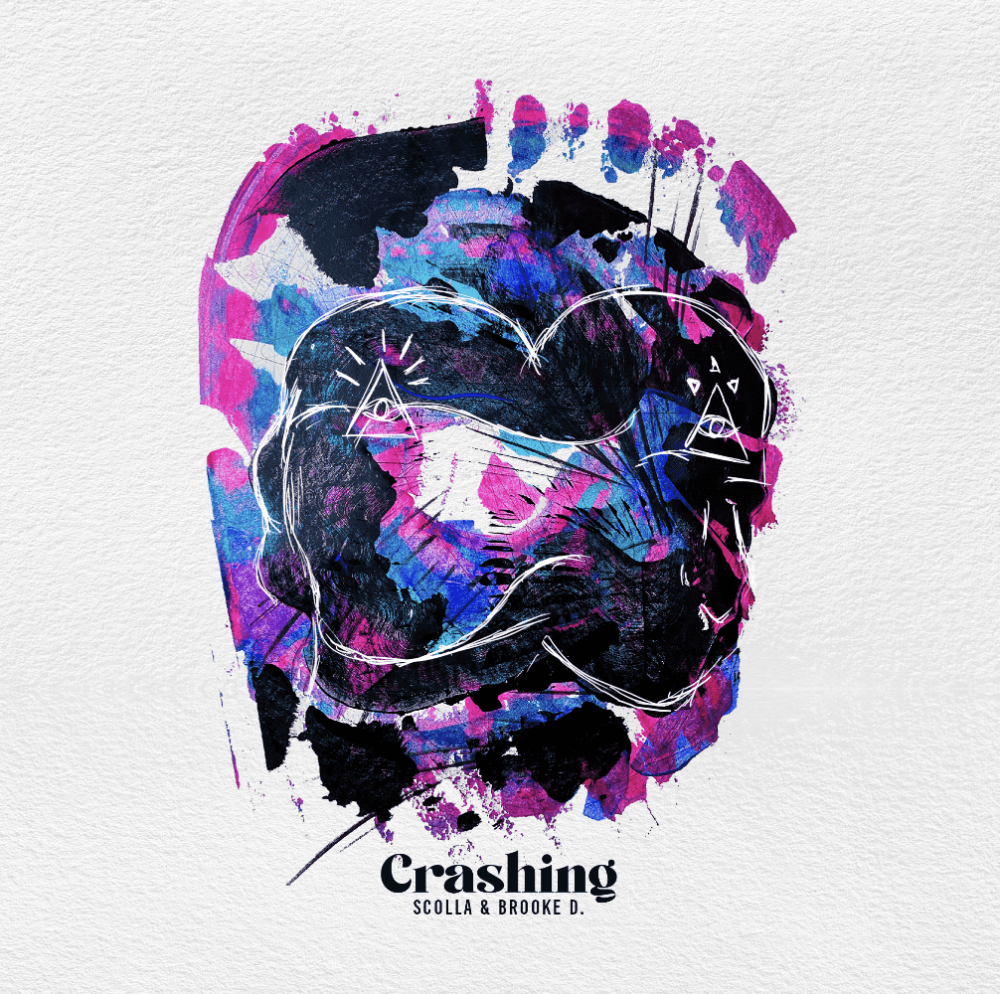

# WhenAliensMeet

**WhenAliensMeet 统计**

创建于 2 个月前

25代币供应，10% 费用

WhenAliensMeet NFT 在过去 7 天内售出 2 次。WhenAliensMeet 的总销售额为 243.71 美元。WhenAliensMeet NFT 的平均价格为 121.9 美元。有 4 位WhenAliensMeet 所有者，总共拥有 25 个代币。

这是与 Scolla 和他的外星朋友合作创造的所有东西的家。

WhenAliensMeet NFT - 常见问题（FAQ）

▶ 什么是WhenAliensMeet？

WhenAliensMeet 是一个 NFT (Non-fungible token) 集合。存储在区块链上的数字艺术品集合。

▶ 有多少WhenAliensMeet 代币？

总共有 25 个 WhenAliensMeet NFT。目前 4 位所有者的钱包中至少有一个 WhenAliensMeet NTF。

▶ WhenAliensMeet 销售中最昂贵的是什么？

最昂贵的WhenAliensMeet NFT 是Crashing [#1/25]。它于 2022 年 7 月 2 日（2 个月前）以 121.9 美元的价格售出。

▶ 最近卖出了多少WhenAliensMeet？

过去 30 天内售出了 2 个 WhenAliensMeet NFT。

