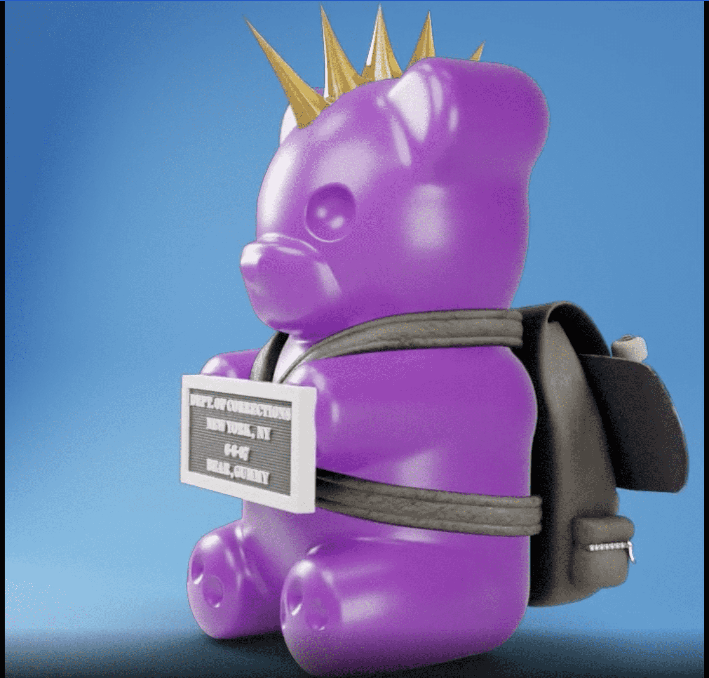

# WhIsBe Vandalz

加入我们的 WhIsBeVerse 之旅，这是一个以艺术为导向、以社区为中心的项目，以协作和联系为中心。每个 Vandal 都允许您访问仅限 Vandal 持有者的数字活动、IRL 活动、独家商品、空投、社交渠道等。WhIsBeVerse 是每个人的家；一个生活的机会，就像我们在路上的另一个岔路口一样。致所有过着充满第二次机会的生活的人……欢迎回家。

当代艺术家 WhIsBe 在街头艺术的叛逆世界以及包括博物馆、画廊和公共设施舞台的主流艺术世界中都建立了令人敬畏的声誉。他的绰号是“什么是美”的简写，既无害又甜美，并引入了更实质性的文化检验和颠覆主题，这些主题突出了他的大部分作品。

WhIsBe 想与更广泛的人分享他的信息，而不仅仅是那些可以进入博物馆和画廊的人，并于 2011 年开始在街头开展自我认可的工作。

WhIsBe 与从 Art Works Charity Foundation 到 Charity Water 再到 Red Bull 再到 COACH 等慈善机构和公司合作，并在包括巴塞尔艺术展、Context & Art Show、Scope 艺术展和南安普顿艺术展在内的重要活动中展出作品。

