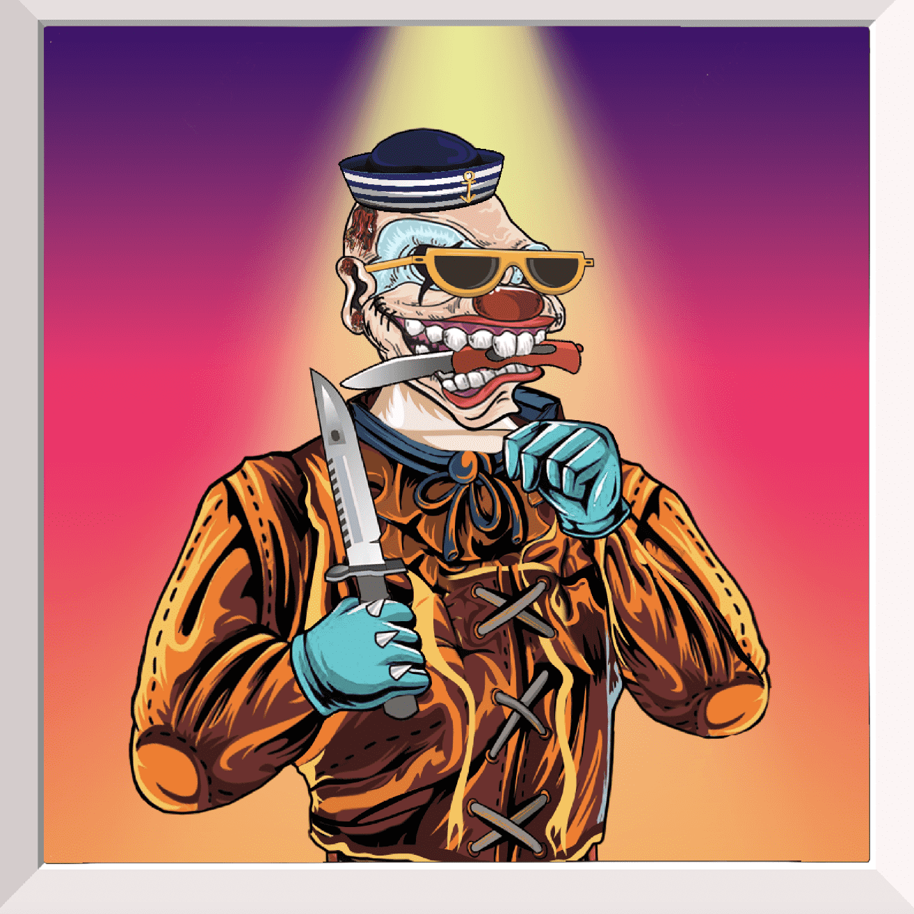

# Wicked Clowns

邪恶小丑 NFT 集合多边形区块链。这是邪恶小丑家族，有自己的规则和法律，每个人都尊重其他家庭成员。通过购买小丑，您成为家庭的一部分，这是最重要的事情。家族有10000个小丑，其中有100个超级稀有的boss小丑。请记住，邪恶的小丑已经来找你了。

邪恶小丑 NFT - 常见问题（FAQ）
▶ 什么是邪恶小丑？
Wicked Clowns 是一个 NFT（非同质代币）集合。存储在区块链上的数字艺术品集合。
▶ 有多少邪恶小丑代币？
总共有 10,001 个 Wicked Clowns NFT。目前，494 位所有者的钱包中至少有一个 Wicked Clowns NTF。
▶ 最近卖了多少邪恶小丑？
过去 30 天内售出 0 个 Wicked Clowns NFT。
▶ 什么是流行的邪恶小丑替代品？
许多拥有 Wicked Clowns NFT 的用户还拥有 I'm Frank、 Rarity Things V2、 DoodleApe和 BRYANZ COLLECTION。

