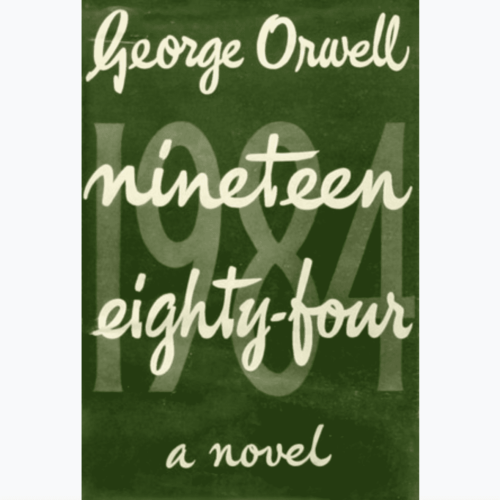

# WikiToken

**维基令牌**

回馈维基媒体的 NFT。

我们绝不隶属于维基媒体；我们只是试图通过出售代币化 NFT 将资金分配给他们。每次二次销售的 10% 被发送到 wikitoken.eth 国库，代币可以在 wikitoken.org 上铸造。

强烈鼓励二次销售，因为铸币费是固定的——出售的代币越高，维基媒体收到的金额就越大。如果你有能力，考虑购买现有的硬币，以及铸造它们。

WikiToken 是一个建立在以太坊区块链上的ERC721 Token，以回馈维基媒体基金会为中心。我们与维基媒体没有任何关系，但我们希望随着时间的推移，我们可以将这个项目转移给他们。
毫无疑问，维基媒体提供了互联网上最重要的教育平台之一。由于他们是非盈利的，他们依靠整个社区来维持组织的运转。通过拥有一个 WikiToken，或为该项目做出贡献，您正在为 Wikimedia 的愿景和可持续性做出贡献。

