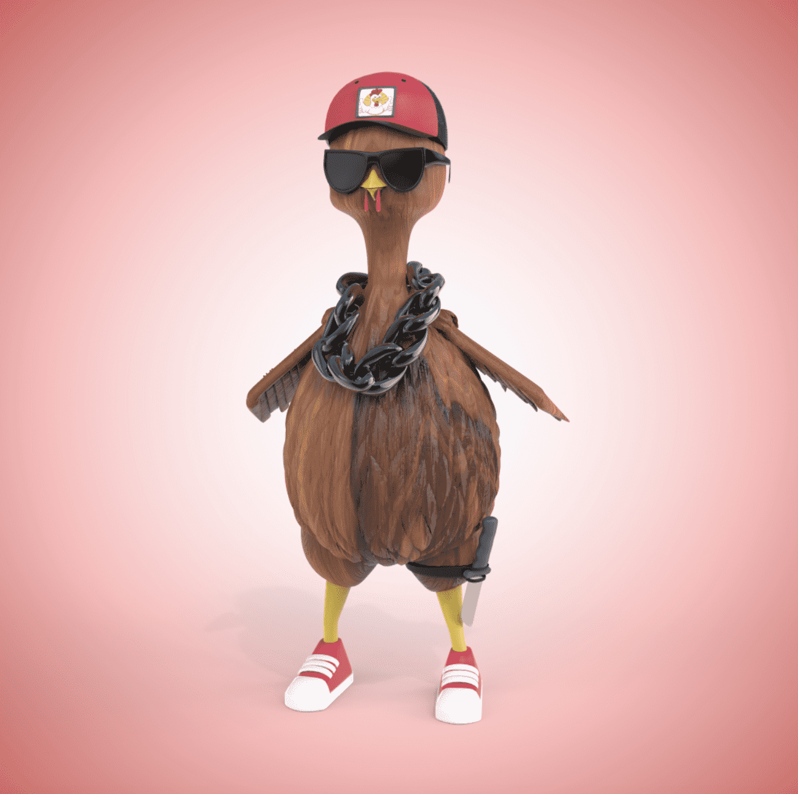

# Wing Wars

**翼战统计**

创建于 3 个月前，5,000 代币供应，10% 费用

Wing Wars NFT 在过去 7 天内售出 5 次。Wing Wars 的总销售额为 3.17 美元。Wing Wars NFT 的平均价格为 0.6 美元。有 539 名 Wing Wars 所有者，拥有总供应量 5,000 个代币。

Wing Wars 是 5000 只在以太坊区块链上生活和呼吸的鸟类的集合。当您的 NFT 被质押在智能合约中时，它们可能会累积一个实用代币（“$CORN”）。$CORN 的主要用途是 Wing Wars P2E 游戏，然而，持有股份的持有者也将能够免费铸造其他鸟类并变异这些......鸡和鸽子很快就会接管元宇宙。

