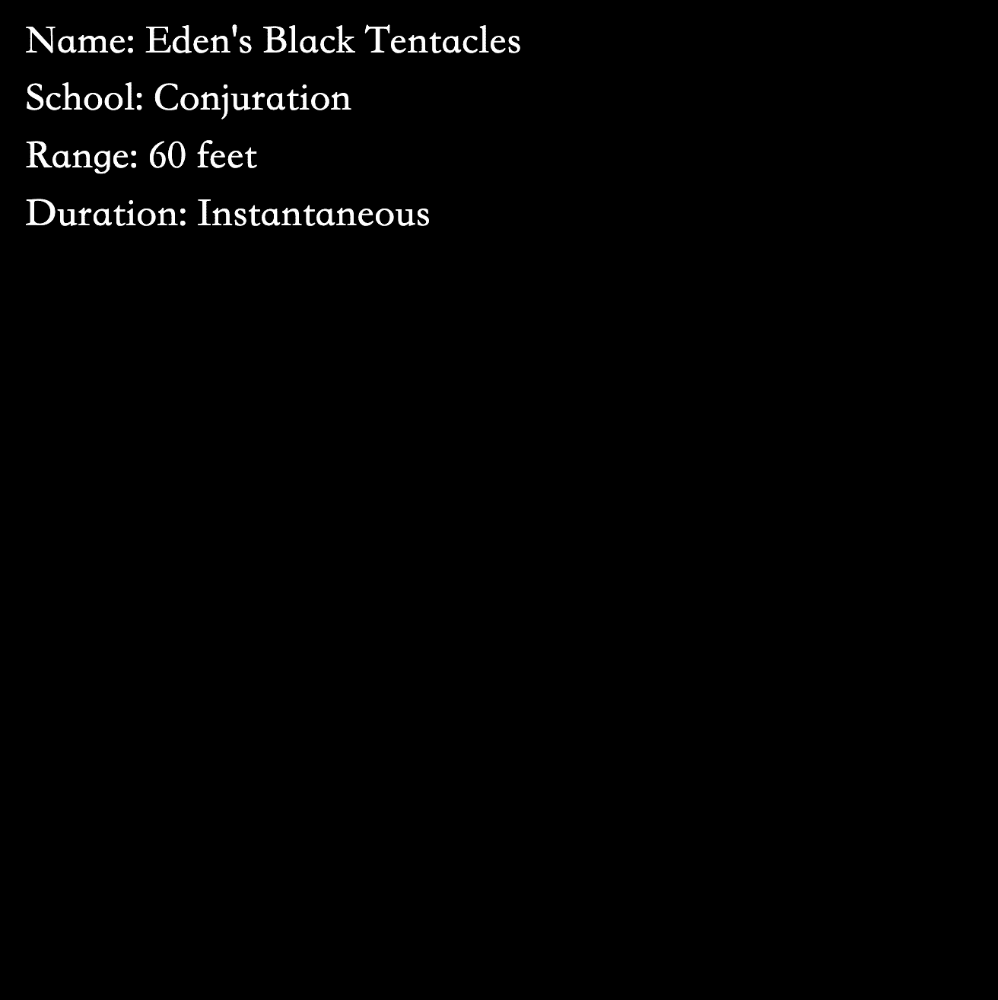

# Spells (for Wizards and other Adventurers)

法术（巫师和其他冒险家）统计
创建于 12 个月前
2,712 代币供应
2.5% 费用
过去 7 天内没有出售任何法术（针对巫师和其他冒险家）。

（非官方）巫师（和其他冒险家）的法术
粉丝艺术图像查看器
https://wizardspellbook.com

由 The Forgotten Runes Wizards Cult 的成员创建
https://www.forgottenrunes.com/

合同
https://etherscan.io/token/0x38e942948cea825992f105e0ec4a2ee9138afae4

Spells (for Wizards and other Adventurers) NFT - 常见问题 (FAQ)
▶ 什么是法术（针对巫师和其他冒险家）？
Spells（适用于巫师和其他冒险家）是一个 NFT（不可替代令牌）集合。存储在区块链上的数字艺术品集合。
▶ 存在多少法术（针对巫师和其他冒险家）代币？
总共有 2,712 个 Spells（针对巫师和其他冒险家）NFT。目前，602 位所有者的钱包中至少有一个 Spells（针对奇才和其他冒险家）NTF。
▶ 最近卖出了多少法术（巫师和其他冒险者）？
过去 30 天内售出了 0 个 Spells（针对巫师和其他冒险家）NFT。

