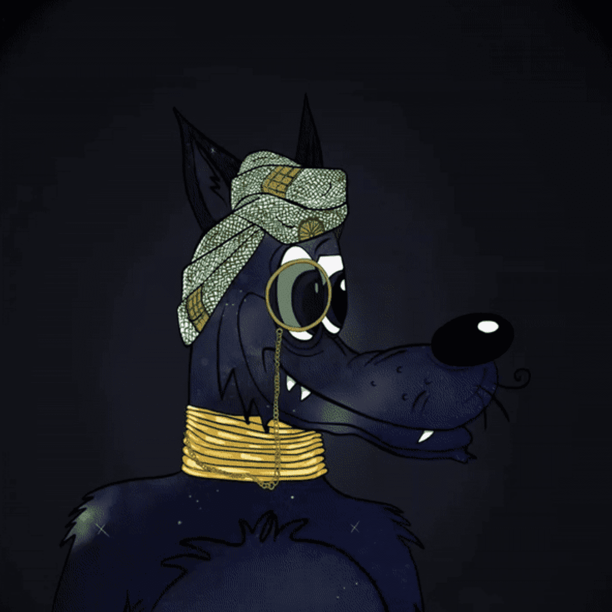

# Wolf Club 86

**狼队86场统计**

创建于大约 1 年前

1,484 代币供应，4% 费用

过去 7 天没有售出 Wolf Club 86。

Wolf Club 86 是一群完全独特的狼。每个人都有自己独特的个性、体型和风格感，以 ERC-721 身份生活在以太坊区块链上。

每个 NFT 都是通过将 150 多个独特特征与不同类别的稀有性相结合而通过算法生成的。

Wolf Club 86 是仅有的几个在达到某些里程碑后向我们的社区提供 50% 版税和 ETH 的项目之一。

事不宜迟，今天就加入我们的行列！

