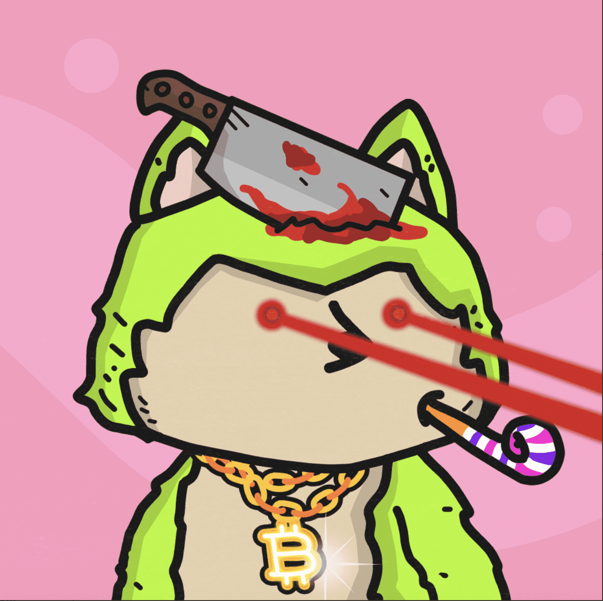

# Wolvie Wolf Club

**Wolvie 狼俱乐部**

🐺Wolvie Wolf 是区块链上 10,000 个随机生成的 NFT 的集合。他们都渴望鲜血，但每只狼都是独一无二的。它从品种开始，然后是 180 多个特征。在该品种之下，狼更加独特，具有多种特征，共同构成了数十亿的艺术！

在有限的时间内，将考虑所有 0.001 WETH 或更高的出价，以确保每个人都能负担得起 Wolvies！

45.43亿年后，地球被人类朋克、猿猴、猫狗控制。狼被排除在外，只有两份糟糕的工作；冬天看森林，夏天追羊。狼是最后一群有远大梦想的狼。他们将很快离开森林并袭击世界其他地方。他们应该再次崛起，回到食物链的顶端。

