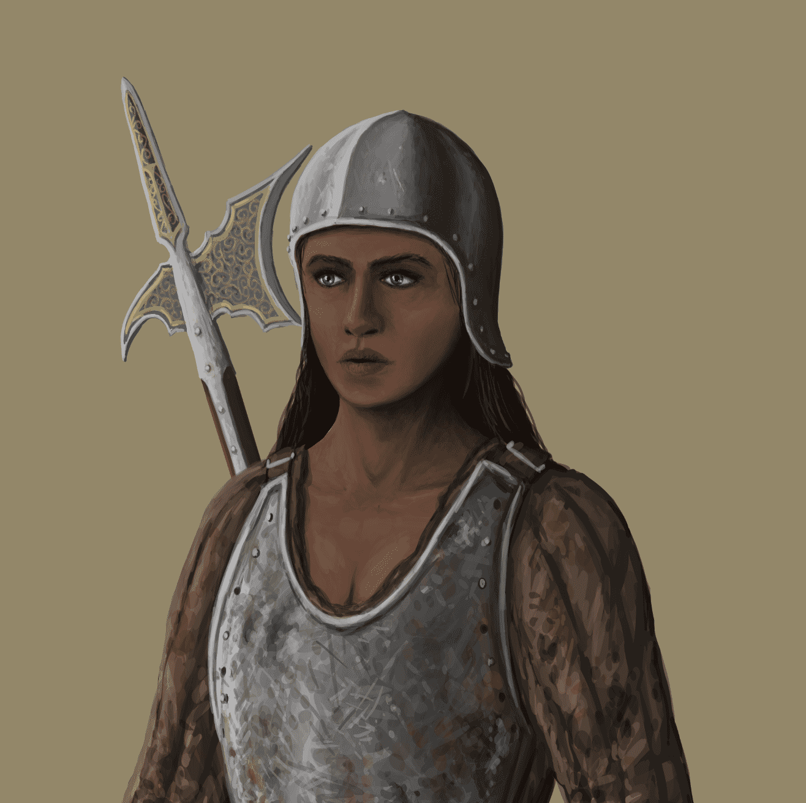

# Women of Aradena

建立你自己独特的军队装备，训练你的单位以升级他们的统计数据，并将你的战士送到招募营地以创建新的战士 NFT。

战斗

让自己沉浸在 3D 战场中，并控制你的军队，在战略 PvP 游戏中与你的对手发动战争。

贸易

从游戏中赢得数百种不同的 NFT 单位，以换取您的军队构建，或在我们的内部市场中与其他玩家进行交易。

竞争

在以技能为基础的战斗中与其他玩家竞争，以获得真正的经济奖励，并作为阿拉德纳最高指挥官的赌注。

Aradena 制定了强有力的计划，通过为玩家提供完整的数字所有权和高质量的游戏体验来推动区块链游戏的采用。 我们很高兴支持 Aradena 为实现这一目标所做的努力。

