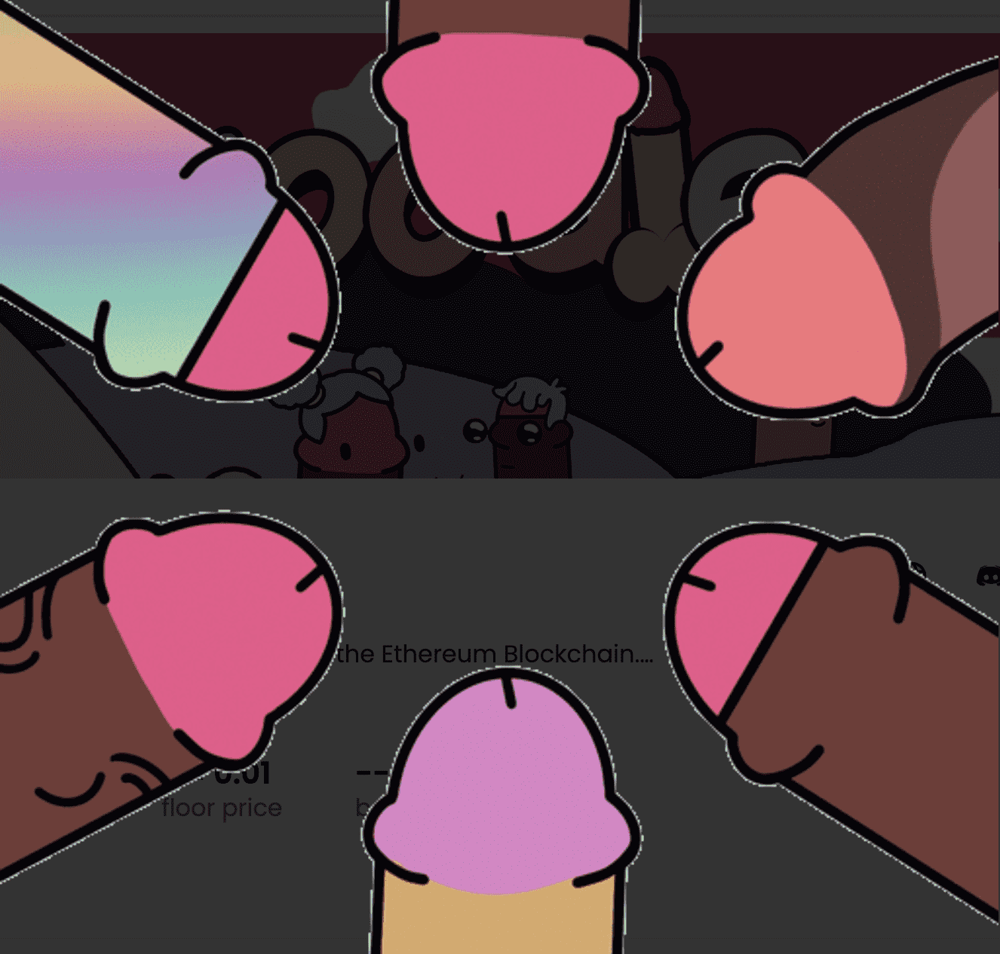

# Woodles V2

**伍德尔斯 V2**

*more_horiz*

一个社区驱动的项目在以太坊区块链上随机生成 NFT。Woodles 有一系列令人愉悦的颜色、形状和尺寸，系列尺寸为 6969。没有完美的木材，这就是为什么你盯着这些而不是你自己的。这些木头对你的钱包来说很难，加入团队，我们越努力，我们就越大。

Woodles 的秘密协会是 6,969 个衍生的 Woodle NFT 的集合——生活在以太坊区块链上的独特的数字和彩色收藏品。注定给你有趣的衍生体验。

