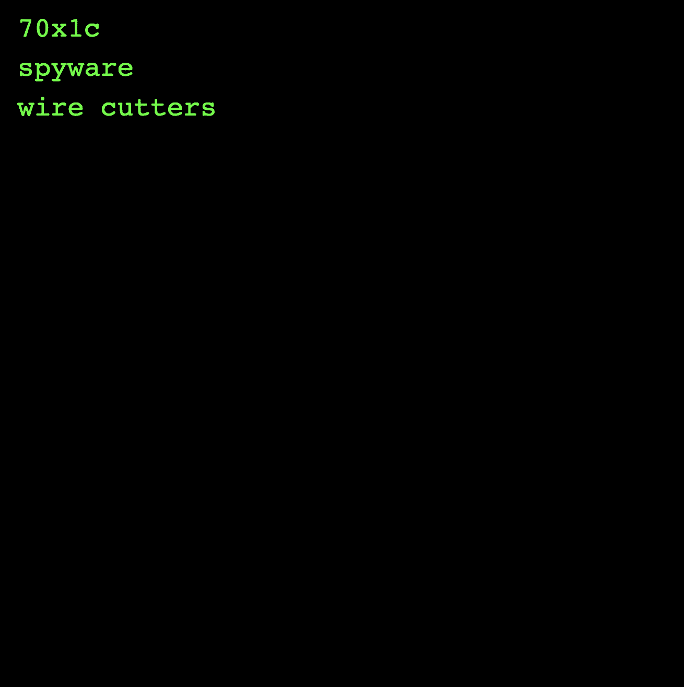

# whoami (t3rm.dev)

**whoami (t3rm.dev)**

*more_horiz*

t3rm.dev 平台的精英收藏身份，共有 1,337 个第 0 代 whoami 代币。每个手柄都是独一无二的。属性包括：头衔、兴趣、服装、装备、安全、软件、交通工具和武器。你是谁？[要在设置完成之前创建一个新身份，请在https://t3rm.dev]w00t上运行：WHOAMI ！

基于文本的 100% 链上艺术品看起来令人难以置信
t3rm.dev 的团队提供。
在全球命令行界面平台的第一层，https://t3rm.dev，我们创建了一个跨多个区块链的开放式系统，任何开发人员都可以部署 CLI Web3 应用程序，收藏家可以像艺术品一样交易他们的商品。

