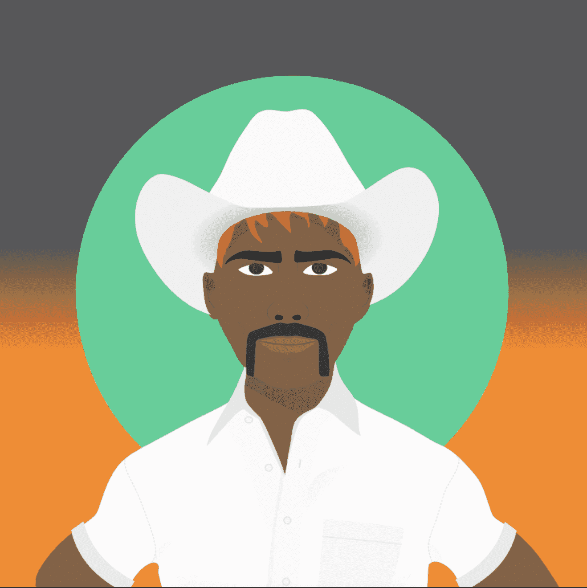

# NFT World of Men

**NFT 男人世界**

*more_horiz*

5,000 个代表男性的独特 NFT，其独特目的是支持心理健康和癌症。

WOM 持有者可以获得独家赠品、AMA、体验等。访问 worldofmen.xyz 铸造你的男人。

50% 的销售额将通过链式捐赠给以下慈善机构：Movember、睾丸癌协会和零用于前列腺癌。

男人 #2886

拥有者 [卡恩特]

*能见度*：14 次观看，*最喜欢的*1 个最爱

*日程*：销售将于 2022 年 9 月 6 日下午 3:04 GMT+8结束 

男人世界：10,000 名独特、酷炫和多样化的男人生活在区块链上。

