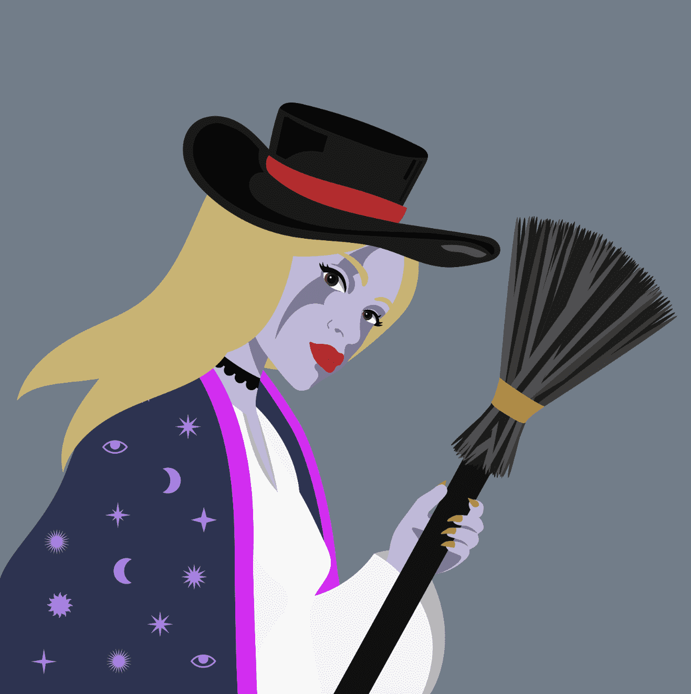

# World of Witches

**女巫会**

位于灵魂之河旁边的深林中，坐落着我们古老的巫师之门，这里曾是过去和现在一些最非凡的女巫的家园。

价值观

包容性
支持
赋权

我们的女巫会旨在增强、包容和支持我们的女巫和 web3 空间内的所有魔法生物。我们希望创造一个让每个人都有归属感的空间，同时在我们不断建立和创新的过程中帮助建立持久的关系。

- 支持女性 web3 艺术家
- 一个对我们的未来有发言权的社区

价值观

世界上最伟大的艺术是讲
故事的艺术

我们相信没有比故事更强大的力量了。它们可以激发想象力，激发信任和信心，并且可以用作团结行动的口号。这就是为什么“女巫世界”的每一步我们都将交织一个故事情节，为我们的项目带来相关性和最重要的乐趣。

