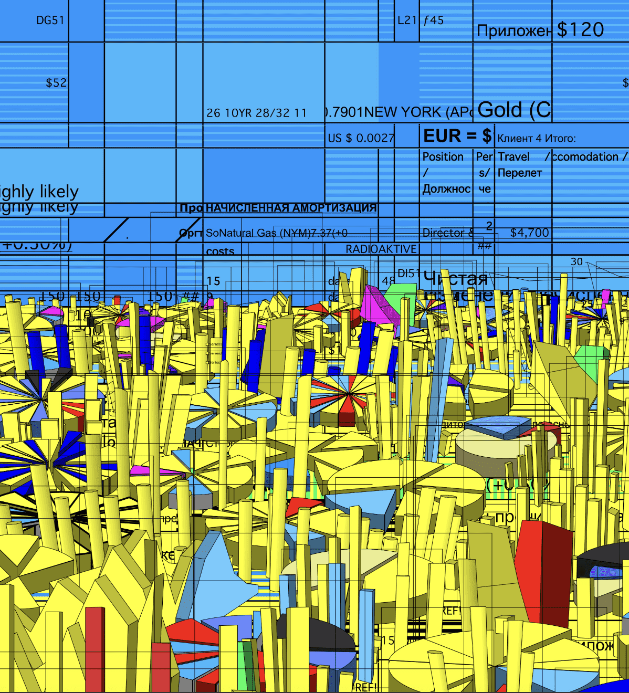

# World Save Ukraine by Holy Water

**圣水拯救乌克兰**

*more_horiz*

WorldSaveUkraine 是一个 NFT 慈善收藏，旨在通过将 100% 的销售额和版税直接捐赠给乌克兰的官方钱包，为乌克兰筹集 100 万美元以上。

我们联合了 400 多位乌克兰艺术家，其中包括最著名的艺术家，他们为该系列提交了他们的作品。俄罗斯不仅入侵了乌克兰，而且挑战了我们几个世纪以来一直在建设的整个民主世界。我们相信，与艺术家合作的 web3 社区可以对当前事件产生巨大影响，并帮助制止这场战争。只有团结起来，共同行动，我们才能赢得和重建正在为全世界而战的乌克兰。

我们是一个 100% 的乌克兰团队，24/7 全天候在乌克兰开展项目，有时来自防空洞。您可以在这里了解更多关于我们团队的信息，如果您有任何问题或想支持乌克兰https://holywater.tech/save-ukraine ，请与我们联系。薄荷是活的！80 件独特的艺术品，每件 120 个版本，总计 9600 个 NFT。

