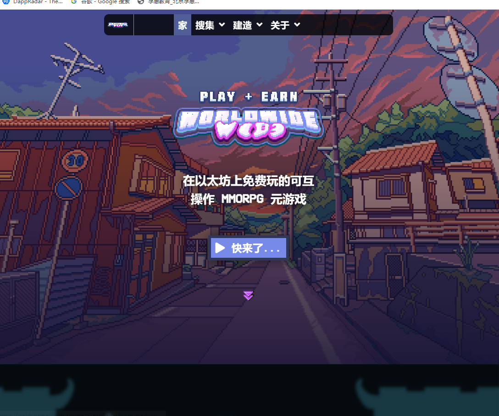

# Worldwide Webb Land

一个可互操作的反乌托邦像素艺术虚拟世界，为流行的 NFT 项目提供实用性。 Worldwide Webb 是一款 MMORPG 虚拟世界游戏，它使用 NFT 来制作游戏中的化身、宠物、土地、物品和任务。由一群加密原生游戏开发人员、艺术家、编码人员和营销人员以构建优先的心态进行部署；快速推出新技术和应用。在以太坊上免费玩的可互操作 MMORPG 元游戏全球 WEBB 是第一款让 NFT 持有者有权扮演他们的化身的元宇宙游戏。想在太空举办派对？ 在丛林中铸造 NFT？ 使用我们的网络构建器只需点击几下即可自定义您的空间。

