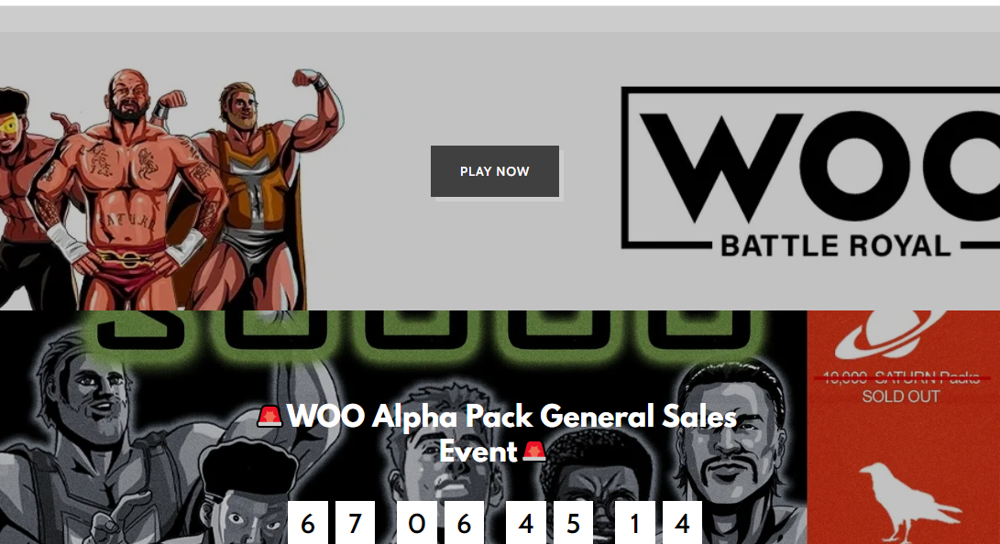

# Wrestling Organization Online

Wrestling Organization Online 是一款靠游戏赚钱的商业管理游戏，玩家可以在其中通过收购摔跤手、升级设施和竞争以赚取更多游戏自己的代币 $WOO 来建立自己的摔跤组织。 - 游戏玩法
我们希望为这款游戏提供独特的体验，因为它在目标受众中有着良好的记录。一直回到早期的摔跤杂志时代，需要创建自己的摔跤手和促销活动，以及与他人竞争。这种趋势一直持续到现代；随着视频游戏的出现，“GM 模式”等游戏模式在社区中受到高度重视。

;这个游戏的每个玩家都会创建和管理一个旅行摔跤;组织。随着他们旅行和发展他们的业务和名册，他们将可以选择一个位置作为运营基地。通过选择运营基地，公司可以开始以各种方式升级他们的组织。 ; 玩家还可以 ; 创建促销活动，这是由各个组织共同合作以增加他们在某个地区的收入的集合。同一地区的竞争对手促销活动将竞争，看看谁是最好的促销活动，并将获得收益。

玩家将能够购买、出售、出租和借用他们的摔跤手给其他玩家。摔跤手也可以升级，并随着技能的提高而解锁新的能力。
摔跤手将主要通过包购买获得，包括以下类型。

男性摔跤手 - 用于男性单人比赛
女子摔跤手 - 用于女子单人比赛
标记队摔跤手 - 用于标记队比赛
经理 - 被指派在比赛中帮助摔跤手

