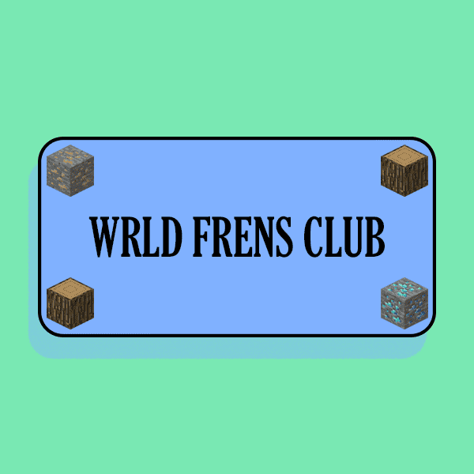

# Wrld Frens Club

**世界弗伦斯俱乐部**

more_horiz
WRLD Frens Club 是一个实验性的 NFT 项目，旨在在 NFT 世界生态系统中创建一个基于玩家的社区。 WFC 最初是一个免费的多边形铸币厂，我们将使用所有交易费用的 90% 来获取由社区钱包持有的 NFT 世界和 NFT 世界项目。 最终每月向持有者空投 $wrld。

Wrld Frens Club Pass 是基于实用程序优先的 NFT Worlds 项目。 WFC 不仅将充当 NFT 世界社区中心，还将每月向持有者空投 $wrld，并通过社区钱包广泛接触 NFT 世界和 NFT 世界项目。

