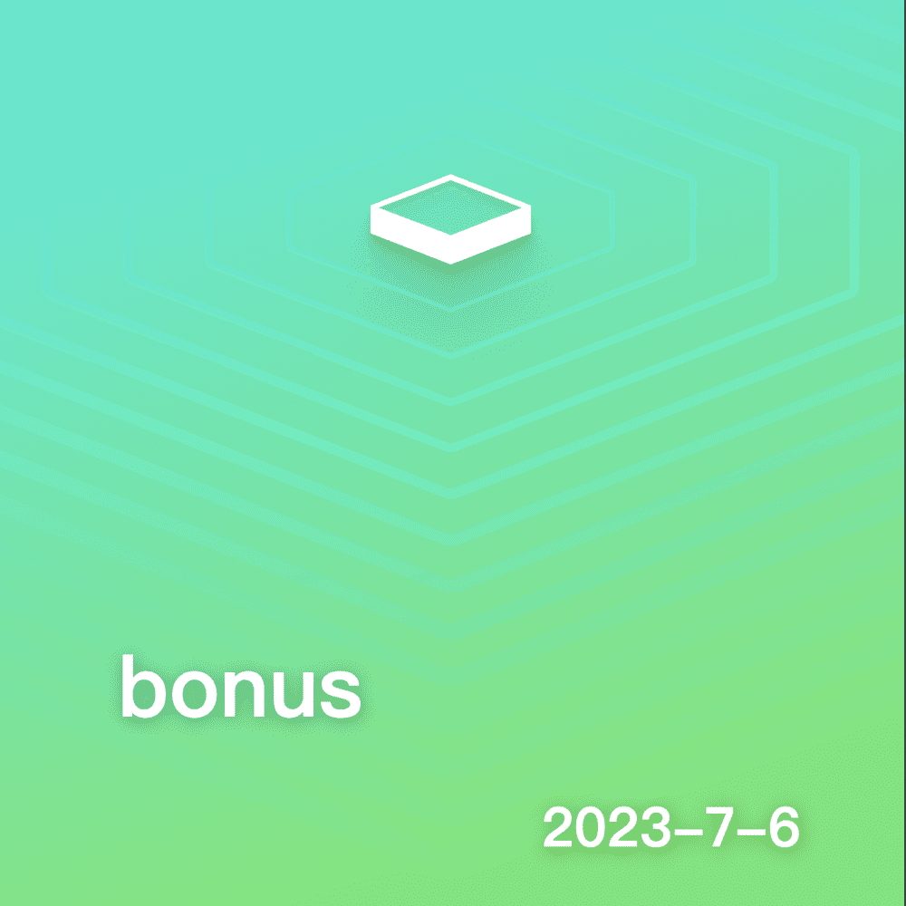

# WNS: WRLD Name Service

**WRLD 名称服务**

more_horiz
立即注册您自己的 .wrld 名称：https://wrld.nameWRLD 名称服务 (WRLDNS) 名称既是与所有元节兼容的玩家代号，也是安全、分散的域名。 WRLDNS 名称为元节、web3 游戏/项目提供了一种分配和跟踪特定于其 WRLDNS 名称的玩家成就和游戏相关数据的方法。 将它们视为您未来可能玩的所有元节/web3 游戏的单一帐户身份。 它们还用作将人类可读名称映射到区块链和非区块链资源的一种方式。WRLDNS 名称被设计为跨链 - 未来支持跨所有主要基于 EVM 的链（如 Polygon、Binance）的名称所有权、数据和记录传播 智能链等。

