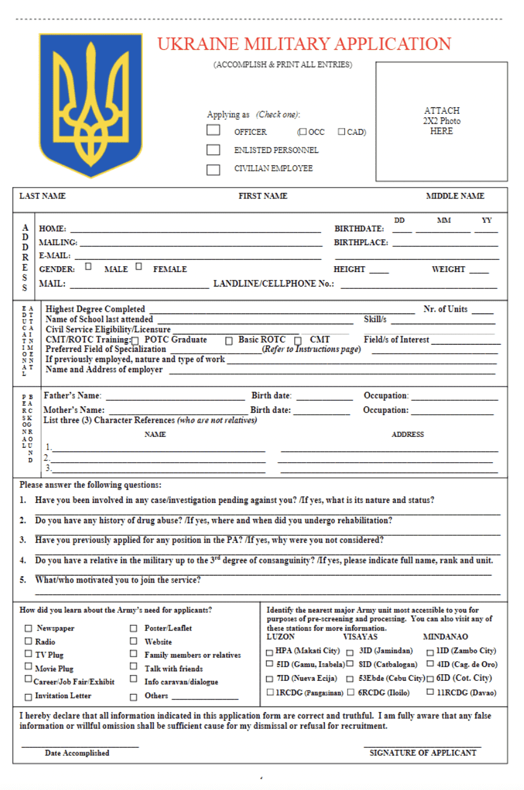

# WW3 Application

**WW3 应用统计**

创建于 6 个月前，299 代币供应，5% 费用

过去 7 天内没有出售任何 WW3 应用程序。

加密货币走向 0？需要喂孩子吗？你很幸运！加入军队，为社会做出贡献。我们想要你。

WW3 应用 NFT - 常见问题（FAQ）

▶ 什么是 WW3 应用程序？

WW3 应用程序是一个 NFT（不可替代令牌）集合。存储在区块链上的数字艺术品集合。

▶ WW3 应用程序代币有多少？

总共有 299 个 WW3 应用 NFT。目前，40 位所有者的钱包中至少有一个 WW3 应用程序 NTF。

▶ 最近卖出了多少 WW3 应用程序？

过去 30 天内售出 0 个 WW3 应用 NFT。

