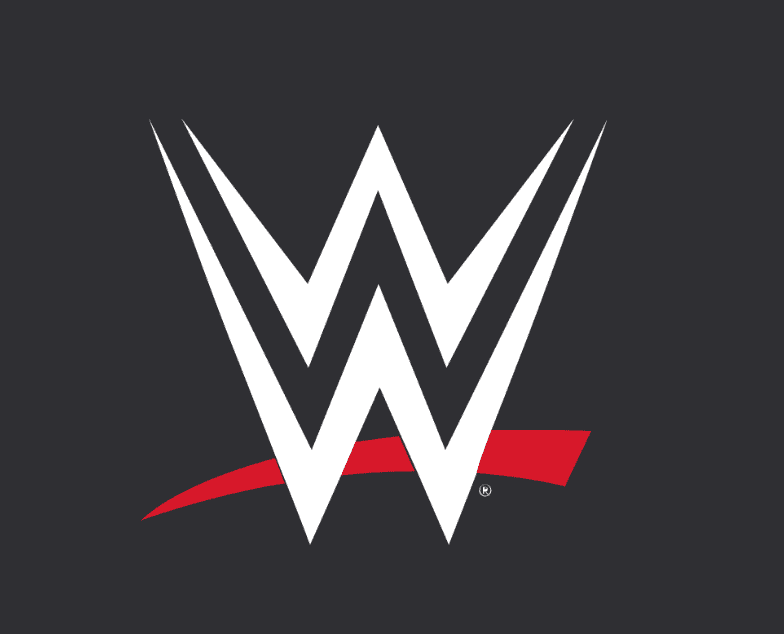

# WWE NFT

过去 7 天没有出售 WWE NFT。

World Wrestling Entertainment 官方 NFT 页面

随着世界即将发生碰撞，Ricochet 向 Carmelo Hayes 提出了挑战

Ricochet 只是 NXT 2.0 上众多令人惊讶的出场之一，这位前洲际冠军在 Worlds Collide 向 Carmelo Hayes 挑战北美冠军头衔。此外，Doudrop 和 Nikki ASH 对 NXT 女子双打冠军 Katana Chance 和 Kayden Carter 也有过类似的挑战，一场全面的斗殴为之前 NXT 2.0 决赛上一场巨大的致命 4 路淘汰双打冠军统一赛奠定了基调世界碰撞这个星期天！

在他们在“格雷森·沃勒效应”的首集节目中激烈的来回争吵之后，阿波罗·克鲁斯和“傲慢的澳大利亚人”决定在擂台上解决问题。当克鲁斯在嘲笑沃勒的同时用雷鸣般的晾衣绳和踢球控制住了两位超级巨星。克鲁斯继续滚动，直到沃勒戳克鲁斯的眼睛，迫使训练员检查克鲁斯的状况。

将训练员送走后，克鲁斯带着一双恩齐古里斯和一连串的晾衣绳集结起来。Crews 与顶级绳索重磅炸弹连接，但 Waller 逃脱并前往他的滚动致昏器，当他跳起来并在下降的途中击中致昏器以确保 pinfall 胜利时戳 Crews 的眼睛。

