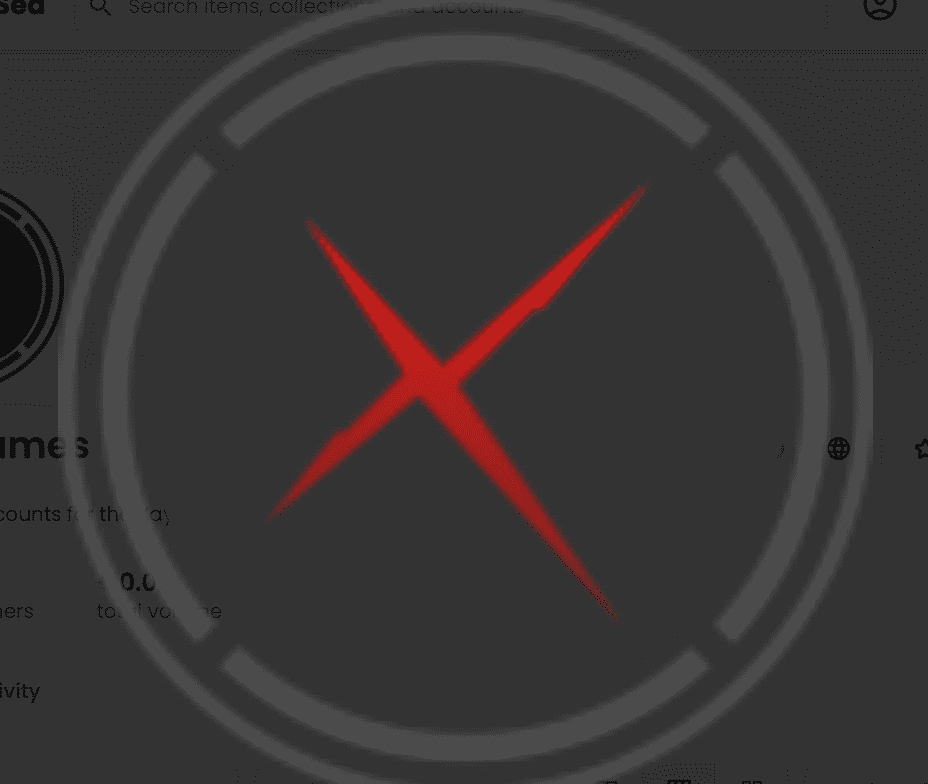

# Xaya Names

使用强大、高度可扩展的区块链后端解决方案为您的游戏创作提供支持

为几乎无限的用户创建高度复杂和可扩展的真正的区块链游戏和去中心化应用程序。XAYA 让您自由地以自己的方式开发游戏！

人力 采矿

一种新兴的游戏类型，首先在 Huntercoin 中引入。在这种类型中，区块链被传播并根据玩家在在线游戏比赛中的成功分配奖励。

Taurion，#1 真正的区块链 MMO

除了区块链，Taurion 是一款非常酷的游戏。4X、RTS、人工挖矿的元素结合在一起，形成了一款前所未见的新游戏。

设定许多 1000 年后的未来，玩家探索 Taurion 星球以寻找自己的财富、结成联盟并相互对抗。

去陶里安！

Soccerverse，同类中最先进的游戏

购买足球俱乐部的股份。管理团队。带领他们走向胜利。名利双收，发家致富！

流行的足球经理系列游戏的这种演变将所有权提升到了一个新的水平。赌注从未如此真实，竞争从未如此激烈。加入精英！！

