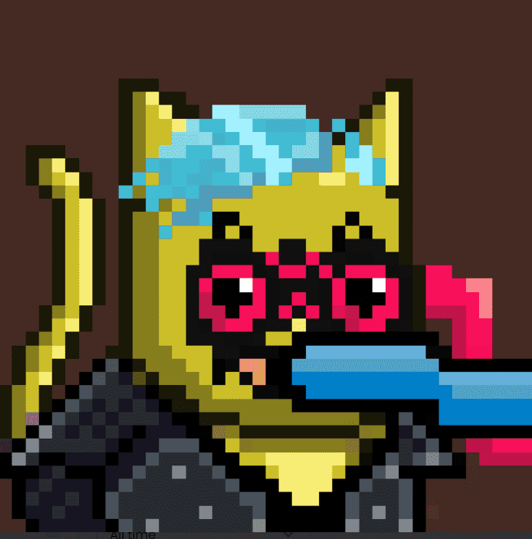

# XCOPY Mooncatz

Meow - Merged - Meow - Mooncatz 和 XCOPY 一起形成 XCOPY Mooncatz。 良好的氛围 - 能量 - 社区。

XCOPY NFT 在过去 7 天内售出 2 次。XCOPY 的总销售额为 47.61 万美元。一份 XCOPY NFT 的平均价格为 2.38 万美元。有 633 个 XCOPY 所有者，拥有 1,415 个代币的总供应量。

XCOPY NFT - 常见问题（FAQ）
▶ 什么是 XCOPY？
XCOPY 是一个 NFT（不可替代代币）集合。存储在区块链上的数字艺术品集合。
▶ 存在多少 XCOPY 代币？
总共有 1,415 个 XCOPY NFT。目前，633 位所有者的钱包中至少有一个 XCOPY NTF。
▶ 最昂贵的 XCOPY 销售是什么？
售出的最昂贵的 XCOPY NFT 是 Siphon #4/20。它于 2022 年 9 月 1 日（大约 8 小时前）以 4.34 万美元的价格售出。
▶ 最近卖出了多少 XCOPY？
过去 30 天内售出了 14 个 XCOPY NFT。
▶ XCOPY 的费用是多少？
在过去 30 天里，最便宜的 XCOPY NFT 销售额低于 3035 美元，最高销售额超过 2.91 万美元。过去 30 天内 XCOPY NFT 的中位价格为 7.2 万美元。
▶ 什么是流行的 XCOPY 替代品？
许多拥有 XCOPY NFT 的用户还拥有 Kolectiv、 Matt Kane的 Gazers和 NACHO BAR。

