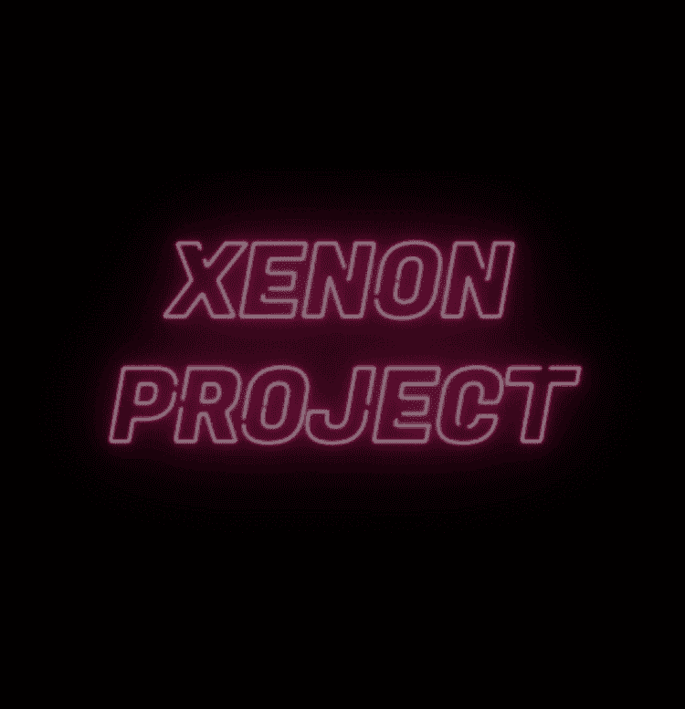

# Xenon-Project

Xenon 是一个基于 3D 的 PFP 项目。 2254 年地球被环境污染所破坏。
大部分人类已经逃往火星，幸存的人类正试图通过躲在六个扇区中生存。
已经撤离到火星的人类计划救援行动，同时通过一个名为“XENON”的类人机器人清洁环境。 2254 年地球被环境污染所破坏。
大部分人类已经逃往火星，幸存的人类正试图通过躲在六个扇区中生存。
撤离到火星的人类计划他们的救援行动，同时通过一个名为“XENON”的类人机器人清洁环境。 版权所有ⓒ XNcompany。 版权所有。

